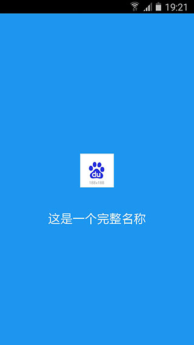
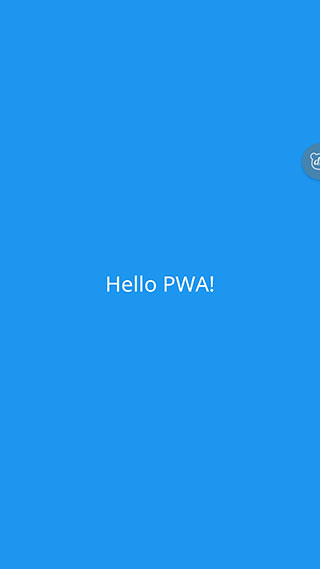
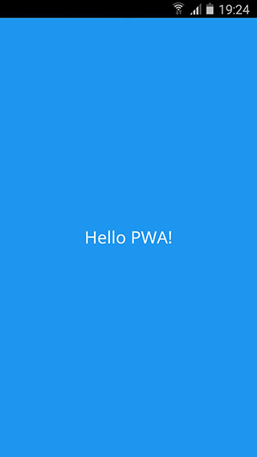
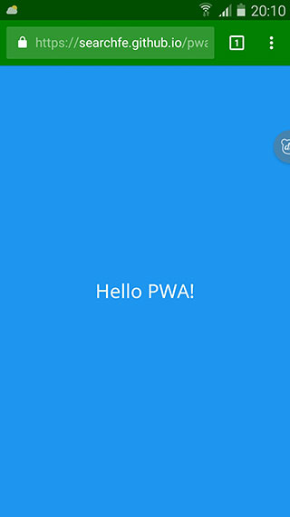
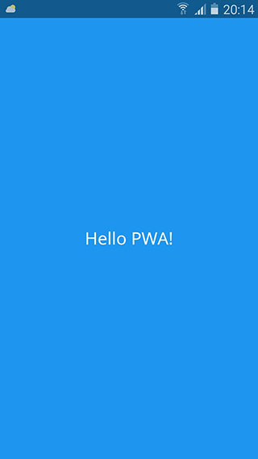

# 改善应用体验

通过对 manifest.json 进行相应配置，可以提升 PWA 从主屏幕启动时的应用体验。

- [添加启动画面](#添加启动画面)
- [设置显示类型](#设置显示类型)
- [指定显示方向](#指定页面显示方向)
- [设置主题色](#设置主题颜色)

## 添加启动画面

当 PWA 从主屏幕点击打开时，幕后执行了若干操作：

1. 启动浏览器
2. 启动显示页面的渲染器
3. 加载资源

在这个过程中，由于页面未加载完毕，因此屏幕将显示空白并且看似停滞。如果是从网络加载加载的页面资源，白屏过程将会变得更加明显。因此 PWA 提供了启动画面功能，用标题、颜色和图像组成的画面来替代白屏，提升用户体验。

### 设置图像和标题

浏览器会从 [`icons`](./02-introduction.md/#自定义图标) 中选择最接近 `128dp` 的图片作为启动画面图像。标题则直接取自 [`name`](./02-introduction.md/#自定义名称)。

### 设置背景颜色

通过设置 `background_color` 属性可以指定启动画面的背景颜色。

- `background_color`:
    `{Color}` css色值

background_color 的值可以通过如下几种形式定义：

```

// 完整色值
"background_color": "#0000ff"
// 缩写
"background_color": "#00f"
// 预设色值
"background_color": "blue"
// rgb
"background_color": "rgb(0, 0, 255)"
// transparent 背景色显示为黑色
"background_color": "transparent"

```

其余诸如`#0000ff90`、`rgba`、`hsl`、`hsla`等颜色定义方式浏览器不支持，因此背景色均显示为默认的白色。

### 设置显示类型

仅当显示类型 `display` 设置为 `standalone` 或 `fullscreen` 时，PWA 启动的时候才会显示启动画面。关于 `display` 的详细介绍请阅读 [`设置显示类型`](#设置显示类型) 章节。

```json

"display": "standalone"

```

**注意**

1. 背景色的色值建议为加载页的背景色，采用相同的颜色可以实现从启动画面到首页的平稳过渡；
2. background_color 应该`只应用于`改善页面资源正在加载时的用户体验。当网页样式表加载完成时，应使用样式表中定义的背景色。

### 示例

对 manifest.json 做如下配置：

```json

{
    "name": "这是一个完整名称",
    "icons": [
        {
            "url": "path-to-images/logo-144x144.png",
            "type": "image/png",
            "sizes": "144x144"
        }
    ],
    "background_color": "#2196f3",
    "display": "standalone"
}

```

则应用启动画面如图所示：



启动画面

## 设置显示类型

可以通过设置 `display` 属性去指定 PWA 从主屏幕点击启动后的显示类型。

- `display`:
    `{string}` 显示类型

显示类型的值包括以下四种：

| 显示类型 | 描述 | 降级显示类型 |
| -------- | ---- | ------------ |
| fullscreen | 应用的显示界面将占满整个屏幕 | standalone |
| standalone | 浏览器相关UI（如导航栏、工具栏等）将会被隐藏 | minimal-ui |
| minimal-ui | 显示形式与standalone类似，浏览器相关UI会最小化为一个按钮，不同浏览器在实现上略有不同 | browser |
| browser | 浏览器模式，与普通网页在浏览器中打开的显示一致 | (None) |

**注意** 可以通过 [`display-mode`](https://developer.mozilla.org/zh-CN/docs/Web/CSS/%40media/display-mode) 这个媒体查询条件去指定在不同的显示类型下不同的显示样式，如：

```css

@media all and (display-mode: fullscreen) {
    body {
        margin: 0;
    }
}

@media all and (display-mode: standalone) {
    body {
        margin: 1px;
    }
}

@media all and (display-mode: minimal-ui) {
    body {
        margin: 2px;
    }
}

@media all and (display-mode: browser) {
    body {
        margin: 3px;
    }
}

```

### 示例

对 PWA 设置以上四种显示类型，对应的应用截图如下所示：



fullscreen



standalone


minimal-ui（由于浏览器不支持，因此降级为browser）


browser


## 指定页面显示方向

PWA允许应用通过设置 `orientation` 属性的值，强制指定显示方向。

- `orientation`:
    `string` 应用显示方向

orientation属性的值有以下几种：

- `landscape-primary`
- `landscape-secondary`
- `landscape`
- `portrait-primary`
- `portrait-secondary`
- `portrait`
- `natural`
- `any`

由于不同的设备的宽高比不同，因此对于`横屏`、`竖屏`不能简单地通过屏幕旋转角去定义。如对于手机来说，`90°` 和 `270°` 为横屏，而在某些平板电脑中，`0°` 和 `180°` 才是横屏。因此需要通过应用视窗去定义。

- 当视窗宽度大于高度时，当前应用处于`横屏`状态。横屏分为两种角度，两者相位差为 `180°`，分别为 `landscape-primary` 和 `landscape-secondary`。
- 当视窗宽度小于等于高度时，当前应用处于`竖屏`状态。同样，竖屏分为两种，两者相位差为 `180°`，分别为 `portrait-primary` 和 `portrait-secondary`。

有了 `landscape-primary`、`landscape-secondary`、`portrait-primary`、`portrait-secondary` 的定义，我们就可以用它们来定义其他的属性值了。

- `landscape`:
    根据不同平台的规则，该值可等效于 `landscape-primary` 或 `landscape-secondary`，或者根据当前屏幕旋转角不同，去自由切换 `landscape-primary` 或 `landscape-secondary`；
- `portrait`:
    根据不同平台的规则，该值可等效于 `portrait-primary` 或 `portrait-secondary`，或者根据当前屏幕旋转角不同，去自由切换 `portrait-primary` 或 `portrait-secondary`；
- `natural`:
    根据不同平台的规则，该值可等效于 `portrait-primary` 或 `landscape-primary`，即当前屏幕旋转角为`0°`时所对应的显示方向；
- `any`:
    根据屏幕旋转角自由切换 `landscape-primary`、`landscape-secondary`、`portrait-primary`、`portrait-secondary`。


## 设置主题颜色

通过设置 `theme_color` 属性可以指定PWA的主题颜色。可以通过该属性来控制浏览器 UI 的颜色。比如 PWA 启动画面上状态栏、内容页中状态栏、地址栏的颜色，会被 `theme_color` 所影响。

- `theme_color`:
    `{Color}` css色值

对于当前版本的 Chrome 浏览器，在 `browser` 显示类型下，内容页的状态栏、地址栏并不会显示成 `theme_color` 所指定的颜色，如图所示：


browser 模式下浏览器UI样式

在指定了 `theme_color` 的值之后，地址栏依然呈白色。针对这种情况，可以在页面 HTML 里设置 `name` 为 `theme-color` 的 `meta` 标签，例如：

```html

<meta name="theme-color" content="green">

```

此时浏览器UI将显示如下：



设置theme-color<meta>的 browser 模式

需要注意的是，这个标签的色值会覆盖 manifest.json 里设置的 `theme_color`，如果两个色值不一样的话，会导致应用启动画面和内容页的主题色不一致，因此建议将 `theme_color` 的色值设置得与 `theme-color<meta>`的色值相等。


### 示例

当manifest设置如下：

```json

{
    "theme_color": "blue",
    "display": "standalone"
}

```

可以看到启动页的状态栏和内容页的状态栏均显示为蓝色。


启动页状态栏呈蓝色



内容页状态栏呈蓝色


如果此时在网页的 HTML 头部加入如下 meta 标签：

```html

<meta name="theme-color" content="green">

```

则对应内容页的状态栏显示为绿色。


启动页状态栏依旧呈蓝色


设置theme-color<meta>后的内容页状态栏呈绿色
