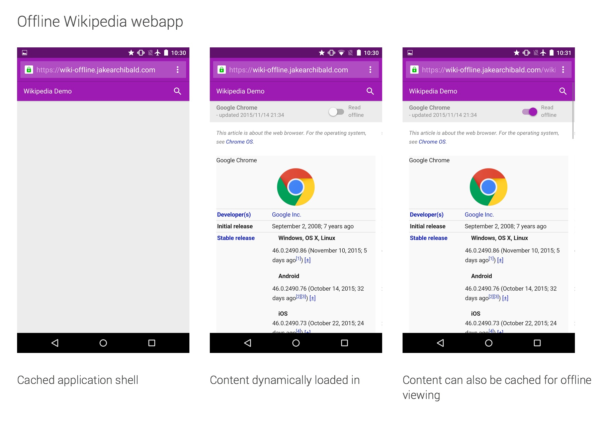

# App Shell 模型

> 本文转载自 develops.google.com
>
> 作者：**Addy Osmani**
>
> 原文链接：[App Shell 模型](https://developers.google.com/web/fundamentals/architecture/app-shell)

__App Shell__ 架构是构建 Progressive Web App 的一种方式，这种应用能可靠且即时地加载到您的用户屏幕上，与本机应用相似。

App“shell”是支持用户界面所需的最小的 HTML、CSS 和 JavaScript，如果离线缓存，可确保在用户重复访问时提供__即时、可靠的良好性能__。这意味着并不是每次用户访问时都要从网络加载 App Shell。 只需要从网络中加载必要的内容。

对于使用包含大量 JavaScript 的架构的[单页应用](https://en.wikipedia.org/wiki/Single-page_application)来说，App Shell 是一种常用方法。这种方法依赖渐进式缓存 Shell（使用服务工作线程）让应用运行。接下来，为使用 JavaScript 的每个页面加载动态内容。App Shell 非常适合用于在没有网络的情况下将一些初始 HTML 快速加载到屏幕上。


换个说法，App Shell 就类似于您在开发本机应用时需要向应用商店发布的一组代码。 它是 UI 的主干以及让您的应用成功起步所需的核心组件，但可能并不包含数据。

## 何时使用 App Shell 模型

构建 PWA 并不意味着从头开始。如果您构建的是现代单页应用，那么您很可能使用的就是类似于 App Shell 的模型，不管您是否这么称呼它。根据您使用的内容库或框架的不同，详细内容可能略有不同，但该概念本身与框架无关。

App Shell 架构具有相对不变的导航以及一直变化的内容，对应于和网站意义重大。 大量现代 JavaScript 框架和内容库已经鼓励拆分应用逻辑及其内容，从而使这种架构更能直接应用。对于只有静态内容的某一类网站，您也可以使用相同的模型，但网站 100% 是 App Shell。

## 优势

使用服务工作线程的 App Shell 架构的优势包括：

* __始终快速的可靠性能。__重复访问速度极快。 第一次访问时即可缓存静态资产和 UI（例如 HTML、JavaScript、图像和 CSS），以便在重复访问时即时加载。内容可能会在第一次访问时缓存到系统中，但一般会在需要时才进行加载。
* __如同本机一样的交互。__通过采用 App Shell 模型，您可以构建如同本机应用一样的即时导航和交互，包括离线支持。
* __数据的经济使用。__其设计旨在实现最少的数据使用量，并且可以正确判断缓存的内容，因为列出不需要的文件（例如，并不是每个页面都显示的大型图像）会导致浏览器下载的数据超出所必需的量。尽管在西方国家和地区中，数据相对较廉价，但新兴市场并非如此，这些市场中连接和数据费用都非常昂贵。

## 要求

App Shell 应能完美地执行以下操作：

* 快速加载
* 尽可能使用较少的数据
* 使用本机缓存中的静态资产
* 将内容与导航分离开来
* 检索和显示特定页面的内容（HTML、JSON 等）
* 可选：缓存动态内容
App Shell 可保证 UI 的本地化以及从 API 动态加载内容，但同时不影响网络的可链接性和可检测性。 用户下次访问您的应用时，应用会自动显示最新版本。无需在使用前下载新版本。

注：[Lighthouse](https://github.com/googlechrome/lighthouse) 审核扩展可用于验证使用 App Shell 的 PWA 是否获得了高性能。

## 构建您自己的 App Shell

构建您自己的应用，明确区分页面 Shell 和动态内容。 一般而言，您的应用应加载尽可能最简单的 Shell，但初始下载时应包含足够的有意义的页面内容。 确定每个数据来源的速度与数据新鲜度之间的正确平衡点。



Jake Archibald 的[离线维基百科应用](https://wiki-offline.jakearchibald.com/wiki/Rick_and_Morty)就是使用 App Shell 模型的 PWA 好例子。它会在重复访问时即时加载，但同时使用 JS 动态抓取内容。系统随后会离线缓存此内容，以备以后访问。

## App Shell 的 HTML 示例

此示例将核心应用基础架构和 UI 从数据中分离出来。请务必使初始加载尽可能简单，在打开网络应用后仅显示页面的布局。有些数据来自于应用的索引文件（内联 DOM、样式），其他数据加载自外部脚本和样式表。

所有 UI 和基础架构都使用服务工作线程本地缓存，因此，随后的加载将仅检索新数据或发生更改的数据，而不是必须加载所有数据。

您工作目录中的`index.html`文件内容应类似于以下代码。 这是实际内容的子集，不是完整的索引文件。 让我们看看它包含的内容。

* 用户界面“主干”的 HTML 和 CSS，包含导航和内容占位符。
* 用于处理导航和 UI 逻辑的外部 JavaScript 文件 (app.js)，以及用于显示从服务器中检索的帖子并使用 IndexedDB 等存储机制将其存储在本地的代码。
* 网络应用清单和用于启用离线功能的服务工作线程加载程序。

```html
<!DOCTYPE html>
<html>
<head>
  <meta charset="utf-8">
  <title>App Shell</title>
  <link rel="manifest" href="/manifest.json">
  <meta http-equiv="X-UA-Compatible" content="IE=edge">
  <meta name="viewport" content="width=device-width, initial-scale=1.0">
  <title>App Shell</title>
  <link rel="stylesheet" type="text/css" href="styles/inline.css">
</head>

<body>
  <header class="header">
    <h1 class="header__title">App Shell</h1>
  </header>

  <nav class="nav">
  ...
  </nav>

  <main class="main">
  ...
  </main>

  <div class="dialog-container">
  ...
  </div>

  <div class="loader">
    <!-- Show a spinner or placeholders for content -->
  </div>

  <script src="app.js" async></script>
  <script>
  if ('serviceWorker' in navigator) {
    navigator.serviceWorker.register('/sw.js').then(function(registration) {
      // Registration was successful
      console.log('ServiceWorker registration successful with scope: ', registration.scope);
    }).catch(function(err) {
      // registration failed :(
      console.log('ServiceWorker registration failed: ', err);
    });
  }
  </script>
</body>
</html>
```

注：请参阅 [https://app-shell.appspot.com/](https://app-shell.appspot.com/)，查看一个非常简单的、使用 App Shell 和内容服务器端渲染的 PWA 的真实演示。App Shell 可通过使用任意内容库或框架实现。

## 缓存 App Shell

您可以使用手动编写的服务工作线程或通过 sw-precache 等静态资产预缓存工具生成的服务工作线程缓存 App Shell。

注：这些示例仅为呈现一般信息以及进行说明而提供。 您的应用使用的实际资源很可能不同。

### 手动缓存 App Shell

以下是使用服务工作线程的 install 事件将 App Shell 中的静态资源缓存到 Cache API 中的服务工作线程代码示例：

```javascript
var cacheName = 'shell-content';
var filesToCache = [
  '/css/styles.css',
  '/js/scripts.js',
  '/images/logo.svg',
  '/offline.html',
  '/'
];

self.addEventListener('install', function(e) {
  console.log('[ServiceWorker] Install');
  e.waitUntil(
    caches.open(cacheName).then(function(cache) {
      console.log('[ServiceWorker] Caching app shell');
      return cache.addAll(filesToCache);
    })
  );
});
```

### 使用 sw-precache 缓存 App Shell

sw-precache 生成的服务工作线程会缓存并提供您在构建过程中配置的资源。 您可以让此线程预先缓存构成 App Shell 的每个 HTML、JavaScript 和 CSS 文件。 所有资源都可以离线工作，并且可在随后的访问中快速加载相关内容，无需其他操作。

以下是在 gulp 构建过程中使用 sw-precache 的基本示例：

```javascript
gulp.task('generate-service-worker', function(callback) {
  var path = require('path');
  var swPrecache = require('sw-precache');
  var rootDir = 'app';

  swPrecache.write(path.join(rootDir, 'service-worker.js'), {
    staticFileGlobs: [rootDir + '/**/*.{js,html,css,png,jpg,gif}'],
    stripPrefix: rootDir
  }, callback);
});
```

注：sw-precache 对于离线缓存您的静态资源非常有用。对于运行时/动态资源，我们建议使用我们的免费内容库 sw-toolbox。

## 结论

使用服务工作线程的 App Shell 是实现离线缓存的强大模式，但同时还可以针对 PWA 的重复访问实现即时加载这一重要性能。您可以缓存自己的 App Shell，以便它可以离线使用并使用 JavaScript 填充其内容。

如果重复访问，这样还可让您在没有网络的情况下（即使您的内容最终源自网络）在屏幕上获得有意义的像素。
