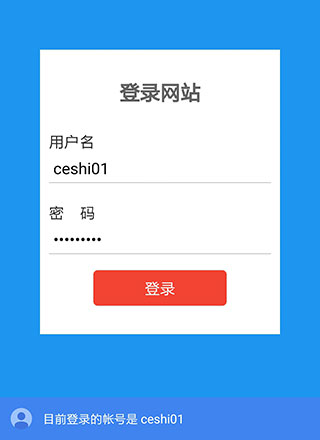

# 账号密码凭证管理

网站通常会自己实现一套登录系统，需要账号和密码作为登录信息。使用凭证管理 API 进行账号密码凭证管理，即可方便快捷地实现自动登录，提升用户体验。

凭证管理 API 提供了 `PasswordCredential` 凭据对象，需要将账号密码信息转换为凭证之后再进行存取操作。

`PasswordCredential` 实现了 `Credetial` 的接口。PasswordCredential 初始化传入的对象需要包含以下信息：

- `id`: **必须** 账号
- `password`: **必须** 密码
- `name`: **非必需** 用户名
- `iconURL`: **非必需** 用户头像，注意 **URL** 三个字母均为大写

如：

```javascript
let cred = new PasswordCredential({
    id: profile.id,
    password: profile.password,
    name: profile.name,
    iconURL: profile.iconUrl
});
```

其中 `name` 和 `iconURL` 是用于账号选择器的显示，因为相比于不易阅读的账号，使用用户名和头像进行账号区分，会显得更加友好。可以在用户登录成功时，从服务端返回相应的信息供存储。


### 存储登录信息

调用 `navigator.credentials.store()` 这个方法进行登录信息存储，如：

```javascript
if (navigator.credentials) {
    var cred = new PasswordCredential({
        id: formData.get('usr'),
        password: formData.get('pwd'),
        // name: nickName,
        // iconURL: iconUrl
    });
    var promise = navigator.credentials.store(cred);
    // 后续操作
}
```

此时会弹出对话框询问用户是否对登录信息进行存储：


只有当用户选择“保存”时，浏览器才会将登录信息存储起来，点击取消则 promise 将变成 reject。

## 获取用户登录信息

在调用 `navigator.credentials.get()` 方法时，需要传入参数 `password: true` 才能够返回类型为 `PasswordCredential` 的登录信息。

举例代码如下：

```javascript
if (navigator.credentials) {
    navigator.credentials.get({
        password: true
    });
}
```

在获取到登录信息之后，可以通过判断 `cred.type === 'password'` 来进一步确认获取到的登录信息属于 `PasswordCredential` 类型：

```javascript
// 在这样的配置下，账号选择器可能会返回
// `PasswordCredential` 或 `FederatedCredential` 的凭证
navigator.credentials.get({
    password: true,
    federated: {
        providers: ['https://www.baidu.com']
    }
})
.then(cred => {
    // cred 可能为 undefined
    if (cred) {
        switch (cred.type) {
            case 'password':
                // 对 PasswordCredential 凭证进行处理
            // ...
        }
    }
});
```

## 示例

完整的示例代码可以 [戳这里](https://github.com/searchfe/searchfe.github.io/blob/master/pwa-demo/credential-demo/login.html)

首先在登录页填写用户名和密码：


点击登录按钮之后，采用 AJAX 方式提交登录信息。AJAX 请求返回如下：

```javascript
{
    "name": "测试名",
    "icon": "https://searchfe.github.io/pwa-demo/credential-demo/images/logo-48x48.png"
}
```

然后，调用凭证管理 API 进行登录信息存储后跳转至登录成功页，代码如下：

```javascript
// fetch('./login.json') 为假装登录并获取登录信息
fetch('./login.json')
.then(res => {
    if (res.status === 200) {
        return res.json();
    }

    return Promise.reject(res.status);
})
// 此处假装登录成功
.then(data => {
    // 此处调用凭证管理 API 进行登录信息存储
    if (navigator.credentials) {
        // 生成密码凭据
        let cred = new PasswordCredential({
            id: usr.value,
            password: pwd.value,
            name: data.name,
            iconURL: data.icon
        });
        // 登录信息存储
        return navigator.credentials.store(cred)
            .then(() => {
                return data;
            });
    }

    return Promise.resolve(data);
})
// 存储完成后再跳转至登录成功页
.then(data => {
    window.location.href = './main.html?from=login&username=' + data.name;
});
```

在存储至少一个登录信息的情况下重新打开登录页，将自动弹出账户选择器：


如果有多个账户的时候，则列表显示多个账户：


点击对应的账户，会自动将账户信息填充至登录表单。这个填充过程实际上是开发者自己控制的，我们也可以拿到账户信息之后，直接去自动登录。对应账户信息获取及填充表单的代码如下：

```javascript
// 获取登录凭证
if (navigator.credentials) {
    navigator.credentials.get({
        password: true
    })
    .then(cred => {
        if (cred) {

            switch (cred.type) {
                case 'password':
                    // 此处为自动填充表单的代码
                    // 开发者可以根据实际需要对账户信息进行其他处理
                    usr.value = cred.id;
                    pwd.value = cred.password;
                    break;
                default:
                    break;
            }
        }
    });
}
```

在`只有一个登录信息`的情况下再次打开登录页，将出现自动登录提示信息：



在登录成功页点击`退出登录`按钮，则自动注销当前凭证，在下次打开登录页时，将会重新弹出账号选择器，而不会自动登录了。注销凭证的代码如下：

```javascript
// 点击按钮触发注销凭证事件
$btn.addEventListener('click', () => {
    // 注销凭证
    navigator.credentials.requireUserMediation()
        .then(afterLogout)
        .catch(afterLogout);
});
```
