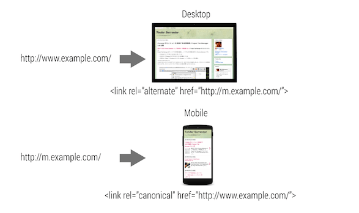
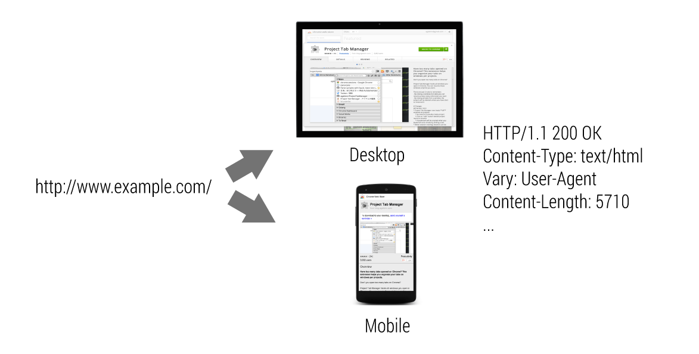

# 搜索优化

> 本文转载自 develops.google.com
> 作者：**Eiji Kitamura**
> 原文链接：[搜索优化](https://developers.google.cn/web/fundamentals/discovery-and-monetization/search-optimization/)

网站的访问者不只有人类，还有搜索引擎网络抓取工具。了解如何改善您的网站的搜索精度和排名。

- 确定网页的网址结构。
- 自适应设计是最受推崇的设计方法。
- 为独立的桌面版本/移动版本网站使用 rel='canonical' + rel='alternate'。
- 为动态提供独立桌面版本/移动版本 HTML 的单个网址使用 Vary HTTP 标头。
- 为您想仅限知晓网址的人访问的页面使用 noindex。
- 为您想保持私有状态的页面使用相关身份验证机制。

## 向搜索引擎提供您的网站结构

您的网站如何出现在搜索结果中对多设备网站设计具有重要意义。本指南会帮助您根据网站的网址结构对其进行搜索引擎优化。

您是否计划构建自适应网页？是否提供采用独立网址的移动设备专用版本？ 您是否从同一网址同时提供桌面版本和移动版本？ 无论是哪一种情况，您始终都能对网站做进一步的搜索引擎优化。

### 指定网站的网址结构

可以通过几种方式向不同设备提供内容。以下是三种最常见的方法：

**自适应网页设计**：从一个网址提供相同的 HTML，并使用 CSS 媒体查询来确定内容在客户端的渲染方式。例如，桌面和移动版本网址：http://www.example.com/

**独立移动版本网站**：根据 User Agent 将用户重定向至不同的网址。 例如，桌面版本网址：http://www.example.com/ 移动版本网址：http://m.example.com/

**动态提供**：根据 User Agent 从一个网址提供不同的 HTML。 例如，桌面和移动版本网址：http://www.example.com/

尽管许多网站采用了其他方法，但最佳方法是使用自适应网页设计。

确定哪一种网址结构适合您的网页。然后，试着按照相应的最佳做法对其进行搜索引擎优化。

### 我们建议采用自适应网页设计

让您的网站采用自适应设计的优点如下：

- 更便于用户分享。
- 网页加载更迅速，无需重定向。
- 单一搜索结果网址。

可通过 [自适应网页设计基础](https://developers.google.cn/web/fundamentals/design-and-ui/responsive/) 知识了解如何构建采用自适应网页设计的网站。

### 提供独立网址时使用 link[rel=canonical] 和 link[rel=alternate]

如果使用不同网址在桌面版本和移动版本上提供类似内容，可能同时给用户和搜索引擎带来困惑，因为查看者并不能轻易发现它们旨在具有完全相同的内容。您应该指示：

- 这两个网址的内容完全相同。
- 哪一个是移动版本。
- 哪一个是桌面（规范）版本。
- 这些信息有助于搜索引擎优化索引内容，以及确保用户找到的目标内容采用的格式适合其所用设备。

#### 为桌面版本使用 alternate

提供桌面版本时，可通过添加带 `rel="alternate"` 属性的 `link` 标记指示还有采用其他网址的移动版本，该标记指向 `href` 属性中的移动版本。

[http://www.example.com/](http://www.example.com/)

    <title>...</title>
    <link rel="alternate" media="only screen and (max-width: 640px)" href="http://m.example.com/">
    

#### 为移动版本使用 canonical

提供移动版本时，可通过添加带 `rel="canonical"` 属性的 `link` 标记指示还有采用其他网址的桌面（规范）版本，该标记指向 `href` 属性中的桌面版本。通过添加值为 `"only screen and (max-width: 640px)"` 的 `media` 属性帮助搜索引擎了解，移动版本明确适用于较小屏幕。

[http://m.example.com/](http://m.example.com/)

    <title>...</title>
    <link rel="canonical" href="http://www.example.com/">
    
  

### 使用 Vary HTTP 标头

根据设备类型提供不同的 HTML 可减少不必要的重定向、提供经过优化的 HTML 以及为搜索引擎提供单一网址。
但它也有几个缺点：

* 用户浏览器与服务器之间可能存在中间代理。除非代理知晓内容随 User Agent 而变化，否则其提供的结果可能出乎意料。
* 根据 User Agent 更改内容存在被视为“[掩蔽](https://support.google.com/webmasters/answer/66355)”的风险，这是违反 Google 网站站长指南的行为。

通过让搜索引擎知晓内容随 User Agent 而变化，它们就能针对发送查询的 User Agent 对搜索结果进行优化。

要指示网址根据 User Agent 提供不同的 HTML，请在 HTTP 标头中提供一个 `Vary: User-Agent`。
这样一来，搜索索引便可对桌面和移动版本进行区别对待，中间代理也可以妥善缓存这些内容。

[http://www.example.com/](http://www.example.com/)

    HTTP/1.1 200 OK
    Content-Type: text/html
    Vary: User-Agent
    Content-Length: 5710
    

如需了解有关构建跨桌面和移动版本的网址结构的更多信息，请阅读[有关构建智能手机优化网站的内容](/webmasters/smartphone-sites/)。

## 控制来自搜索引擎的抓取和索引操作

将网站妥善列入搜索引擎对将其推广至全球至关重要，但不良配置可能导致结果中包含意料之外的内容。此部分通过说明抓取工具的工作和网站索引编制原理来帮助您避免此类问题。

没有比网络更好的信息共享场所。当您发布一份文档时，全世界可立即获得。
任何知晓网址的人都能看到网页。
搜索引擎的作用就在于此。它们必须能够找到您的网站。

不过，在某些情况下，尽管您希望人们访问您的网站，却不想让他们找到这些文档。
例如，博客的管理员页面只有特定人员才有权访问。
让人们通过搜索引擎找到这些页面没什么好处。

此部分还说明如何禁止某些页面出现在搜索结果中。

### “抓取”与“索引”之间的区别

在了解如何控制搜索结果之前，您需要先了解搜索引擎如何与您的网页进行交互。从网站的视角来看，搜索引擎对网站执行的操作主要有两项：抓取和索引。  

**抓取**是指搜索引擎自动程序获取网页以分析其内容。内容存储在搜索引擎的数据库中，可用于填充搜索结果详情、为网页排名以及通过逐层深入链接发现新的网页。  

**索引**是指搜索引擎将网站的网址以及任何关联信息存储在其数据库内，以便随时充当搜索结果。 

注：许多人混淆了抓取和索引。禁止抓取并不意味着网页不会出现在搜索结果中。例如，如果某个第三方网站具有您的某个网页的链接，即使禁止了抓取，也仍可对其进行索引。在此情况下，搜索结果将缺少详细说明。

### 使用 robots.txt 控制抓取

您可以利用名为 `robots.txt` 的文本文件控制良性抓取工具获取网页的方式。`Robots.txt` 是一个简单的文本文件，用于说明您希望搜索自动程序如何抓取您的网站。
（并非所有抓取工具都一定会遵守 `robots.txt`。
料想一定有人会自行创建不正当的抓取工具。）

将 `robots.txt` 置于网站主机的根目录。例如，如果网站的主机是 `http://pages.example.com/`，则 `robots.txt` 文件应位于 `http://pages.example.com/robots.txt`。如果该域名有不同的架构、子域名或其他端口，则将其视为不同的主机，应在每个主机的根目录中放置 `robots.txt`。

以下是一个简短的示例：  

**http://pages.example.com/robots.txt**

    User-agent: *
    Disallow: /
    

这表示您想禁止所有自动程序抓取您的整个网站。

下面是另一个示例：

**http://pages.example.com/robots.txt**

    User-agent:Googlebot
    Disallow: /nogooglebot/
    

您可以通过指示 User Agent 名称来指定每个自动程序 (User Agent) 的行为。
在上例中，您禁止名为 `Googlebot` 的 User Agent 抓取 `/nogooglebot/` 以及该目录下的所有内容。
  

可通过各搜索引擎自动程序的帮助页面了解更多相关信息：

* [Google](/webmasters/control-crawl-index/docs/robots_txt)
* [Bing](http://www.bing.com/webmaster/help/how-to-create-a-robots-txt-file-cb7c31ec)
* [Yandex](https://help.yandex.com/webmaster/controlling-robot/robots-txt.xml)

注：**仅当**您想控制网站的抓取方式时，才需要使用 `robots.txt`。请勿为网址 `/robots.txt` 返回响应代码 500。这会终止对整个主机的所有后续抓取，导致搜索结果详情不包含任何内容。

#### 测试 robots.txt

根据 robots.txt 所针对的抓取工具，搜索引擎提供商可能会提供相应工具来测试 `robots.txt`。
例如，对于 Google，其[网站站长工具](https://www.google.com/webmasters/tools/robots-testing-tool)中有一个验证器可用来测试 robots.txt。

Yandex 也提供了[类似的工具](https://webmaster.yandex.com/tools/robotstxt/)。  

### 使用元标记控制搜索索引

如果您不希望网页出现在搜索结果中，则 robots.txt 并非解决方案。
您需要允许抓取这些网页，并明确指示您不希望对它们进行索引。
有以下两个解决方案：

要表示您不希望索引某个 HTML 网页，请使用特定类型的 `<meta>` 标记，并将其属性设置为 `name="robots"` 和 `content="noindex"`。  

    <!DOCTYPE html>
    <html><head>
    <meta name="robots" content="noindex" />
    

您可以通过将 `name` 属性的值更改为特定 User Agent 名称来缩小范围。例如，`name="googlebot"`（不区分大小写）表示您不希望 Googlebot 索引该网页。  

    <!DOCTYPE html>
    <html><head>
    <meta name="googlebot" content="noindex" />
    

robots 元标记的其他选项包括：  

* [Google](/webmasters/control-crawl-index/docs/robots_meta_tag)
* [Bing](http://www.bing.com/webmaster/help/which-robots-metatags-does-bing-support-5198d240)
* [Yandex](https://help.yandex.com/webmaster/controlling-robot/html.xml)

#### X-Robots-Tag

要表示您不希望索引图像、样式表或脚本文件等资源，请在 HTTP 标头中添加 `X-Robots-Tag: noindex`。

    HTTP/1.1 200 OK
    X-Robots-Tag: noindex
    Content-Type: text/html; charset=UTF-8
    

如果您想把范围缩小到特定 User Agent，请在 `noindex` 前插入 User Agent 名称。  

    HTTP/1.1 200 OK
    X-Robots-Tag: googlebot: noindex
    Content-Type: text/html; charset=UTF-8
    

如需了解有关 X-Robots-Tag 的更多信息：  

* [Google](/webmasters/control-crawl-index/docs/robots_meta_tag)
* [Bing](http://www.bing.com/webmaster/help/how-can-i-remove-a-url-or-page-from-the-bing-index-37c07477)

注：如果您利用 `robots.txt` 禁止抓取，由于并不知晓您不希望索引这些网页，搜索自动程序可能仍会对它们进行索引。之所以可能发生这种情况，是因为：<ul><li>搜索自动程序可能是循着其他网站上的链接找到您的网页。</li><li>无法抓取的搜索引擎检测不到  <code>noindex</code>。</li></ul>

别指望 `robots.txt` 能够控制搜索索引。

### 不同内容类型的示例

什么是控制抓取和索引的最佳解决方案？以下是一些针对不同网页类型的示例解决方案。

#### 可供任何人全面访问和搜索的网页

网络上的大多数网页均属这一类型。  

* 无需使用 `robots.txt`。
* 无需使用 robots 元标记。

#### 仅限知晓网址的人员访问

示例包括：  

* 博客管理员控制台的登录页面。
* 通过传递面向初级互联网用户的网址分享的私有内容。

在此情况下，您不希望搜索引擎索引这些网页。  

* 无需使用 `robots.txt`。
* 为 HTML 网页使用 `noindex` 元标记。
* 为非 HTML 资源（图像、PDF 等）使用 `X-Robots-Tag: noindex`。

> 注：想知道您是否应禁止抓取 JavaScript 和样式表文件？<a href='http://googlewebmastercentral.blogspot.com/2014/05/understanding-web-pages-better.html' target='_blank'>Google 会尽最大努力理解它们</a>，以便能找到通过 AJAX 等现代化技术提供的内容。您当然应该允许抓取工具抓取 JavaScript。

#### 仅限获得授权的人员访问

在此情况下，即使有人找到了网址，如果没有有效凭据，服务器也会拒绝提供结果。例如：  

* 社交网络上私人分享的内容。
* 企业支出系统。

对于这些类型的网页，搜索引擎应该既不抓取也不索引它们。  

* 为凭据无效的访问返回响应代码 401“未经授权”（或将用户重定向至登录页面）。
* 请勿使用 `robots.txt` 禁止抓取这些网页。否则将检测不到 401。

此处的限制机制可能是 IP 地址、Cookie、初级身份验证、OAuth 等。
如何实现此类身份验证/授权取决于您的基础架构，这些内容超出了本文的范围。

### 请求从搜索引擎中移除网页

在下列情况下，您可能希望移除某个搜索结果：  

* 页面不再存在。
* 某个被意外索引的网页包含机密信息。

主流搜索引擎均提供了通过发送请求来移除此类网页的途径。移除过程通常包含下列步骤：  

1. 确保您想移除的网页：
    * 已从服务器删除，并返回 404
    * 配置为不进行索引（例如：noindex）

1. 转到各搜索引擎上的请求页面。（Google 和 Bing 要求您注册并验证对网站的所有权。）
1. 发送一个请求。

可在各搜索引擎的帮助页面查看具体步骤：  

* [Google](https://support.google.com/webmasters/answer/1663419)
* [Bing](http://www.bing.com/webmaster/help/bing-content-removal-tool-cb6c294d)
* [Yandex](https://help.yandex.com/webmaster/yandex-indexing/removing-from-index.xml)

### 附录：抓取工具 User Agent 列表

* [Google](https://support.google.com/webmasters/answer/1061943)
* [Bing](http://www.bing.com/webmaster/help/which-crawlers-does-bing-use-8c184ec0)
* [Yandex](https://help.yandex.com/search/robots/logs.xml)