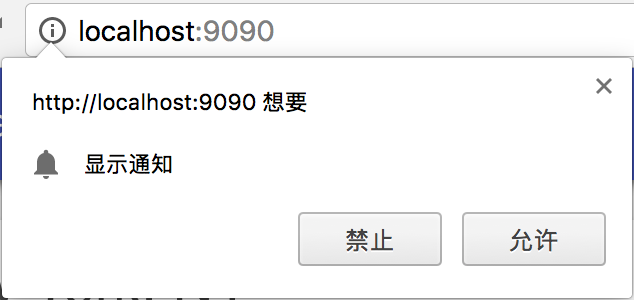
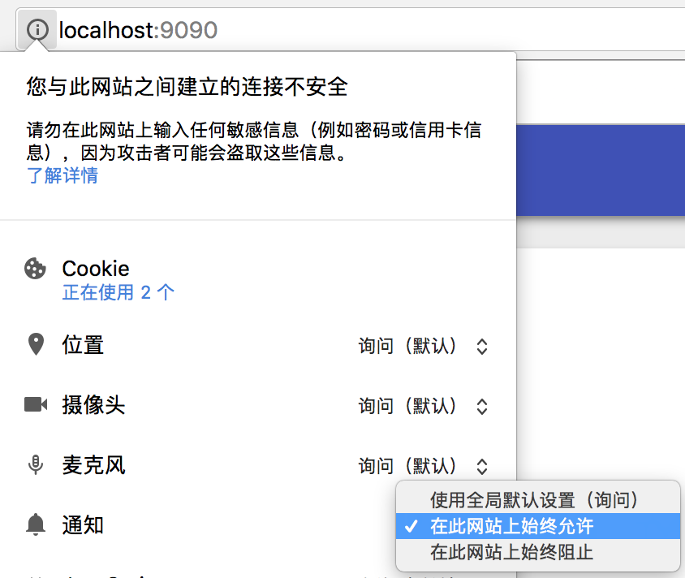

# 消息推送介绍

消息推送有着十分广阔的应用场景：
- 新品上架，推送消息给用户，点击即进入商品详情页面。
- 用户很久没有进入站点了，推送消息告知这段时间站点的更新。

使用推送消息通知，能够让我们的应用像 Native App 一样，提升用户体验。

但是目前[整体支持度并不高](http://caniuse.com/#search=push)，在手机端更是只有安卓 Chrome57 支持。

如同淘宝卖家将商品送到用户家中需要依赖快递公司，服务器向浏览器推送消息，也需要推送服务(Push Service)的帮助。
下面让我们看看**服务器**，**浏览器**和**推送服务**这三者在推送过程中扮演的角色。

## 获取授权

在订阅消息之前，浏览器需要得到用户授权，同意后才能使用消息推送服务。



显示以上对话框有两种方式：
1. 在订阅之前先获取用户授权，使用`Notification.requestPermission`
2. 如果不选择使用方法1，在正式订阅时浏览器也会自动弹出，对于开发者而言不需要显式调用

在第一种使用`Notification.requestPermission`的方式中，由于[通知API](https://developer.mozilla.org/en-US/docs/Web/API/Notification/requestPermission)还不稳定，需要兼容新旧版本的返回值：

``` javascript
function askPermission() {
    return new Promise(function (resolve, reject) {
        var permissionResult = Notification.requestPermission(function (result) {
            // 旧版本
            resolve(result);
        });
        if (permissionResult) {
            // 新版本
            permissionResult.then(resolve, reject);
        }
    })
    .then(function (permissionResult) {
        if (permissionResult !== 'granted') {
            // 用户未授权
        }
    });
}
```

值得注意的是，当用户允许或者拒绝授权后，后续都不会重复询问。
想要更改这个设置，在 Chrome 地址栏左侧网站信息中如下：



## 订阅推送服务

如同卖家只有获取了买家的地址簿，才能委托快递公司发货。服务端作为消息来源，委托推送服务发送消息给订阅消息的浏览器，也必须知道浏览器的具体地址。

这个具体的地址是推送服务产生的，不同的服务端和不同的浏览器都会产生不同的地址。那么在订阅时服务端（也就是我们的应用）就需要一个唯一标识的身份。

### applicationServerKey

这里就需要引入`applicationServerKey`的概念，它又被称作[VAPID](https://tools.ietf.org/html/draft-thomson-webpush-vapid)，这就是我们应用的唯一标识。

生成`applicationServerKey`的方法有两种：
1. 在服务端使用 web-push 生成，在后续“使用web-push发送消息”一节中会详细介绍
2. 访问[https://web-push-codelab.appspot.com/](https://web-push-codelab.appspot.com/)快速生成

此时得到的`applicationServerKey`是base64编码后的字符串，需要转换成`UInt8Array`格式，才能作为订阅方法接受的参数。

另外要注意，生成`applicationServerKey`的同时，会同时生成与之配对的私钥，用于后续服务端请求推送服务的安全验证（详见后续“消息推送安全性”一节），因此这个私钥是绝对不能暴露在页面中的。

### 推送订阅对象

拥有了服务端的唯一标识，浏览器可以开始向推送服务发起订阅请求了，有两点要注意：
1. 请求推送服务的地址对于开发者而言是无法指定的，完全由浏览器决定。
2. 在请求发送之前，浏览器已经生成了一个推送订阅对象(PushSubscription)。得到响应之后，会将推送服务生成的地址加入这个推送订阅对象中。

一个完整的推送订阅对象结构如下：

``` json
{
    "endpoint": "https://fcm.googleapis.com/fcm/send/...",
    "keys": {
        "p256dh" : "BNcRd...",
        "auth"   : "tBHI..."
    }
}
```

其中`endpoint`就是推送服务返回的唯一标识用户设备的地址，而`keys`是浏览器预先生成的，包含了用于安全验证信息，在后续向推送服务发送消息时会使用到（详见后续“消息推送安全性”一节）。

### 订阅消息的具体实现

订阅消息的具体实现步骤如下：

1. 注册 Service Worker
2. 使用 pushManager 添加订阅，浏览器向推送服务发送请求，其中传递参数对象包含两个属性：
    * `userVisibleOnly`，不允许静默的推送，所有推送都对用户可见，所以值为`true`
    * `applicationServerKey`，服务器生成的公钥
3. 得到推送服务成功响应后，浏览器将推送服务返回的 endpoint 加入推送订阅对象，向服务器发送这个对象供其存储

以上步骤对应的具体代码实现如下：

``` javascript
// 将base64的applicationServerKey转换成UInt8Array
function urlBase64ToUint8Array(base64String) {
    var padding = '='.repeat((4 - base64String.length % 4) % 4);
    var base64 = (base64String + padding)
        .replace(/\-/g, '+')
        .replace(/_/g, '/');
    var rawData = window.atob(base64);
    var outputArray = new Uint8Array(rawData.length);
    for (var i = 0, max = rawData.length; i < max; ++i) {
        outputArray[i] = rawData.charCodeAt(i);
    }
    return outputArray;
}
function subscribe(serviceWorkerReg) {
    serviceWorkerReg.pushManager.subscribe({ // 2. 订阅
        userVisibleOnly: true,
        applicationServerKey: urlBase64ToUint8Array('<applicationServerKey>')
    })
    .then(function (subscription) {
        // 3. 发送推送订阅对象到服务器，具体实现中发送请求到后端api
        sendEndpointInSubscription(subscription);
    })
    .catch(function () {
        if (Notification.permission === 'denied') {
            // 用户拒绝了订阅请求
        }
    });
}
if ('serviceWorker' in navigator && 'PushManager' in window) {
    navigator.serviceWorker.register('./service-worker.js')  // 1. 注册Service Worker
        .then(function(reg) {});
    navigator.serviceWorker.ready.then(function(reg) {subscribe(reg)});
}
```

### 非标准浏览器

如果订阅时第二步`pushManager.subscribe()`中缺少了`applicationServerKey`参数，我们会得到这样的错误信息：


错误信息中前半段显而易见，但后半段中提到的`gcm_sender_id`是什么呢？

GCM(Google Cloud Messaging)是 Google 早期的推送服务，现已更名为 FCM(Firebase Cloud Messaging)，对于旧版本的 Chrome 浏览器，`gcm_sender_id`相当于`applicationServerKey`。

如果开发者想兼容这些老版本的浏览器，那么可以参考[非标准浏览器的兼容措施](https://web-push-book.gauntface.com/chapter-06/01-non-standards-browsers/)。

### 取消订阅

在某些情况下，例如服务端请求推送服务，返回了推送服务失效错误码，此时需要[取消订阅](https://developer.mozilla.org/en-US/docs/Web/API/PushSubscription/unsubscribe)，代码实现如下：

```javascript
navigator.serviceWorker.ready.then(function (reg) {
    reg.pushManager.getSubscription()
        .then(function (subscription) {
            subscription.unsubscribe()
                .then(function (successful) {
                    //
                })
                .catch(function (e) {
                    //
                });
        });
});
```

## 发送消息

现在我们有了买家的地址，需要委托快递公司发货。

所有推送服务都遵循统一的调用标准，好比快递公司有着全国统一的上门服务电话，这就是 [Web Push Protocol](https://tools.ietf.org/html/draft-ietf-webpush-protocol) 。

推送服务接到了服务器的调用请求，向设备推送消息，如果处于离线状态，消息将进入待发送队列，过期后队列清空，消息被丢弃。

下面介绍保证消息安全的原理，以及在实际使用中服务端的具体代码实现。

### 消息推送安全性

商品需要包裹封装，就连快递公司也无权拆开。

消息推送的安全体现在两方面：
- 推送服务确保调用来自可靠的服务端
- 推送消息内容只有浏览器能够解密，就算是推送服务也不行

下面简单介绍下保证安全性的原理，如果只关心实际项目中的具体实现，可以直接跳到“使用web-push发送消息”这一节。

#### 保证服务端可靠性

服务器在调用推送服务时，需要额外发送请求头，例如*Authorization*和*Crypto-Key*，首先介绍 Authorization。

> [JWT(JSON Web Token)](https://jwt.io/)提供了一种消息接收者验证发送者的方法。

Authorization 就包含了 JWT 格式的字符串：
`Authorization: 'WebPush <JWT Info>.<JWT Data>.<Signature>'`

Authorization 的内容由三部分组成，使用`.`连接，前两部分是使用base64编码后的JSON字符串：
- JWT Info，指明了签名使用的加密算法

```json
{
    "typ": "JWT",
    "alg": "ES256"
}
```

- JWT Data，包含发送者的信息，推送服务的源地址，失效时间，和发送者的联系方式

```json
{
    "aud": "https://some-push-service.org",
    "exp": "1469618703",
    "sub": "mailto:example@web-push-book.org"
}
```

- 签名，连接前两部分，服务端使用私钥加密。还记得之前添加订阅的时候，使用到的服务端生成的公钥吗，此处使用的正是与之配对的私钥

另外，请求头中还需要将公钥带给推送服务：
`Crypto-Key: p256ecdsa=<URL Safe Base64 Public Application Server Key>`

这样，当推送服务收到服务端的调用请求时，使用公钥解密 Authorization 签名部分，如果匹配前两部分，说明请求来自可靠的服务端。

#### 消息内容加密

由于推送 API 的统一性，用户可能误发消息到不信任的推送服务，对消息进行加密可以确保只有浏览器端才能解密读取，防止将用户信息泄露给不合法的推送服务。

还记得最初用户订阅成功后，浏览器生成的推送订阅对象吗？里面包含了`endpoint`，而加密过程会使用其中的`keys`对象。

[复杂的加密过程](https://developers.google.cn/web/fundamentals/engage-and-retain/push-notifications/web-push-protocol)在这里就不展开介绍了。总之，只有订阅的浏览器能使用生成的私钥解密推送的消息。

### 推送服务的响应

现在，服务端可以向 endpoint 发送包含以上请求头的请求了，推送服务响应`201`表示接受调用。
其余响应状态码如下：
- 429 Too many requests
- 400 Invalid request
- 404 Not Found 订阅过期，需要在服务端删除保存的推送订阅对象
- 410 Gone 订阅失效，需要在服务端删除保存的推送订阅对象，并调用推送订阅对象的`unsubscribe()`方法
- 413 Payload size too large

### [使用web-push发送消息](#web-push)

服务端请求推送服务，需要涉及加密，设置请求头等复杂操作，使用[web-push](https://github.com/web-push-libs/web-push)可以帮助我们解决大部分问题。

步骤如下：
1. 使用 web-push 生成一对公私钥，还记得 pushManager 订阅时需要用到的`applicationServerKey`吗，我们需要公钥`publicKey`传递到订阅脚本所在的页面中。
2. 调用`setVapidDetails`为 web-push 设置生成的公私钥
3. 之前订阅时浏览器已经将推送订阅对象发送到了服务端，此时从数据库中取出。
4. 调用`sendNotification`向推送服务发起调用请求，如果返回错误状态码，从数据库中删除保存的推送订阅对象。

以上步骤实现代码如下：

``` javascript
var webpush = require('web-push');
var vapidKeys = webpush.generateVAPIDKeys(); // 1.生成公私钥
webpush.setVapidDetails( // 2.设置公私钥
    'mailto:sender@example.com',
    vapidKeys.publicKey,
    vapidKeys.privateKey
);
// 3.从数据库中拿出之前保存的pushSubscription，具体实现省略
// 4.向推送服务发起调用请求
webpush.sendNotification(pushSubscription, '推送消息内容')
    .catch(function (err) {
        if (err.statusCode === 410) {
            // 从数据库中删除推送订阅对象
        }
    });
```

## 显示通知

想象一个卖家常驻小区的派送员，收到快递公司的商品，上门按下买家的门铃。
Service Worker 就是扮演这样的角色，它监听 push 事件，显示通知。

使用消息中携带的数据，展示通知，此处省略了通知对象(Notification)的配置信息，示例代码如下：

``` javascript
self.addEventListener('push', function (event) {
    if (event.data) {
        var promiseChain = Promise.resolve(event.data.json())
                .then(data => self.registration.showNotification(data.title, {}));
        event.waitUntil(promiseChain);
    }
});
```

至此，整个推送流程就结束了。对于开发者而言，只需要关心服务器和浏览器端的修改。
