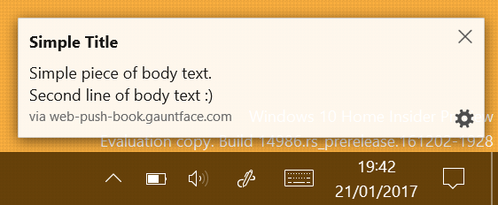
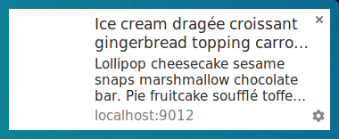
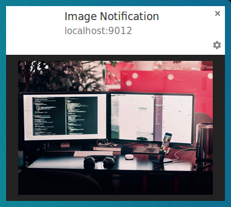
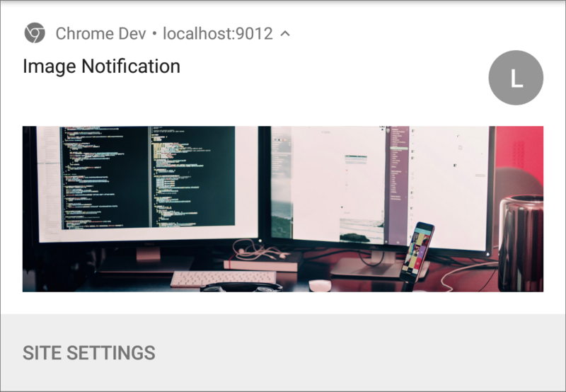
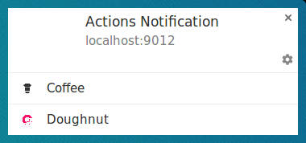
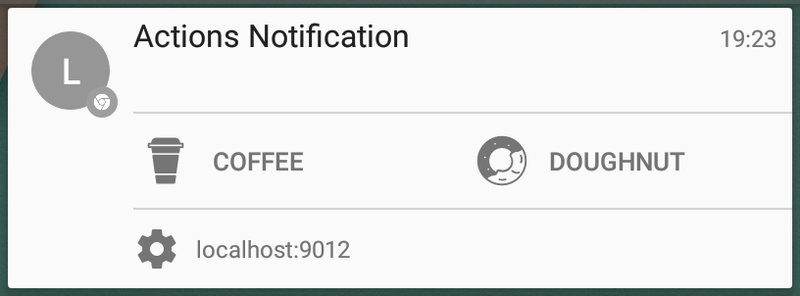
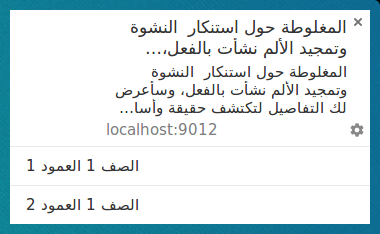

# 视觉部分

## 标题和内容

如上所述，标题可以通过 `showNotification` 的第一个参数设置。而通知内容可以通过配置项中的 `body` 进行设置。如下：
```
registration.showNotification('Simple Title', {
    body: 'Simple piece of body text.\nSecond line of body text :)'
});
```

在Google Chrome中，我们会得到这样的通知


Firefox则略有差别，在Linux系统的Firefox中，通知会是这样


而在Windows系统的Firefox中，通知会是这样



到这里我们可以注意到，通知在不同的浏览器以及不同的操作系统中展现的样式并不相同。事实上：
1. 不同的操作系统有自身的通知样式。Firefox浏览器直接使用系统通知样式
2. 特别的，Google Chrome有自己定制的样式，以保持在各个操作系统的一致性

当标题和内容长度超过一定限制时，通知会自行处理。例如在Google Chrome中会自动截断：



在Firefox中会更友善一些，当鼠标浮在内容上，会展现全部内容：


## 图标(icon)

你可能注意到了在Google Chrome下通知的左侧有一大段空白区域。这里其实是用来显示图标的，为此我们需要用到配置项的 `icon` ，如下：
```
registration.showNotification('Icon Notification', {
    icon: 'https://gss0.bdstatic.com/9rkZbzqaKgQUohGko9WTAnF6hhy/assets/example/icon-512x512.png'
});
```

在Chrome上的通知样式如下：


在Firefox样式如下：


在图标尺寸方面并没有一个明确的规定。普通情况下建议使用192px\*192px以上的图片进行设置(64px\*3)。

另外某些浏览器要求静态资源必须通过HTTPS访问，因此在使用第三方图片资源时要格外注意。

## 小图标(Badge)

小图标(Badge)是在手机上展现通知缩略信息时使用的图标。我们可以使用如下代码
```
registration.showNotification('Badge Notification', {
    badge: 'https://gss0.bdstatic.com/9rkZbzqaKgQUohGko9WTAnF6hhy/assets/example/badge-128x128.png'
});
```

目前仅出现在Android系统的Google Chrome上，效果如下：


在其他情况下，或者当我们没有设置 `Badge` 时，图标会展示为一个浏览器的图标。


小图标的注意点和图标相同，尺寸建议为72px\*72px以上(24px\*3)，同样尽量使用HTTPS资源。

## 图片(image)

和图标(icon)不同，图片(image)在通知的展现尺寸要大不少，可以给用户展现一些预览图片。我们可以使用如下代码
```
registration.showNotification('Image Notification', {
    image: 'https://gss0.bdstatic.com/9rkZbzqaKgQUohGko9WTAnF6hhy/assets/example/unsplash-farzad-nazifi-1600x1100.jpg'
});
```

在PC的Google Chrome上，效果如下：



在Android系统的Google Chrome上，效果略有不同。可以看到图片经过了裁剪，如下：



因为两种平台上图片展现的差别比较大，因此很难给出一个完美适应的图片尺寸。从目前经验来看，使用宽度为1350px(450px\*3)以上的图片会比较合适。但必须指出一点，因为图片相对来说还是一个比较新的配置项，因此以后可能会被修改。

最后，在Firefox中，图片暂时无法显示：


## 按钮(Actions)

我们可以通过使用 `actions` 配置项来为通知增加一些按钮，代码如下：
```
registration.showNotification('Actions Notification', {
    actions: [
        {
            action: 'coffee-action',
            title: 'Coffee',
            icon: 'https://gss0.bdstatic.com/9rkZbzqaKgQUohGko9WTAnF6hhy/assets/example/action-1-128x128.png'
        },
        {
            action: 'doughnut-action',
            title: 'Doughnut',
            icon: 'https://gss0.bdstatic.com/9rkZbzqaKgQUohGko9WTAnF6hhy/assets/example/action-2-128x128.png'
        },
        {
            action: 'gramophone-action',
            title: 'gramophone',
            icon: 'https://gss0.bdstatic.com/9rkZbzqaKgQUohGko9WTAnF6hhy/assets/example/action-3-128x128.png'
        },
        {
            action: 'atom-action',
            title: 'Atom',
            icon: 'https://gss0.bdstatic.com/9rkZbzqaKgQUohGko9WTAnF6hhy/assets/example/action-4-128x128.png'
        }
    ]
});
```

通过以上代码，我们为通知增加了4个按钮。但事实上在不同情况下一条通知可显示的按钮数量是有限的（记录在 `Notification.maxActions` 变量中），超过的部分就将被省略。在本文编写时，Google Chrome允许一条通知中显示2个按钮，因此效果如下：



我们注意到 `actions` 配置项是一个数组，每个元素为一个对象，而每个对象都必须拥有3个属性。除了按钮标题和图标地址之外，每个对象还拥有一个唯一的ID，记录于 `action` 属性中。它会在按钮被点击时使用到，这些会在行为部分中进行介绍。

此外，在Android6.0 Marshmallow版本中，图标的颜色可能会被设置为匹配系统的颜色，如下所示：



在Android Nougat版本中按钮暂时不会显示。

关于按钮图标方面，我们有一些建议：

1. 所有图标使用一个相同的色系，以保证给用户带来的感官是一致的。
2. 图标尺寸建议使用128px\*128px
3. 某些情况下按钮不会显示，需要做好应对。

在本文编写的时候，只有Google Chrome和Opera for Android支持按钮(Actions)。

## 文字方向

如果我们需要控制文字的方向，可以使用 `dir` 配置项。它的合法值为 `'auto'`, `'ltr'`或者`'rtl'`。其中`'auto'`会自动根据文字内容来选择方向，例如阿拉伯文会自动从右到左显示，默认值为`'auto'`。




## 震动

我们可以使用 `vibrate` 配置项来设置通知的震动模式。 `vibrate` 以数组的形式进行配置，其中的数字以2个为一组，分别表示震动的毫秒数，和不震动的毫秒数，如此往复。
```
registration.showNotification('Vibrate Notification', {
    vibrate: [500,110,500,110,450,110,200,110,170,40,450,110,200,110,170,40,500]
});
```

注意部分设备可能不支持 `vibrate` 配置项。

## 声音

按照规范，声音可以使用 `sound` 配置项进行配置，用以在通知弹出时播放对应的音频文件。
```
registration.showNotification('Sound Notification', {
    sound: 'https://gss0.bdstatic.com/9rkZbzqaKgQUohGko9WTAnF6hhy/assets/notification-sound.mp3'
});
```

然而很遗憾，目前并没有浏览器支持 `sound` 配置项。

## 时间戳

我们可以使用 `timestamp` 配置项来达到定时发送通知的目的。 `timestamp` 配置项的值是数字类型，表示设定时间距离1970年1月1日0点的毫秒数。例子如下：
```
registration.showNotification('Timestamp Notification', {
    body: 'Timestamp is set to "01 Jan 2000 00:00:00".',
    timestamp: Date.parse('01 Jan 2000 00:00:00')
});
```

## 使用通知的一些建议

虽然目前使用通知的站点并不多，但在这些站点中问题也不少。最常见的问题在于通知的目的和内容无法被用户理解，反而造成了不良的用户体验。我们的目标是利用尽可能多的配置项来让用户明确一条通知的内容和目的。下面是一些常见的错误，我们应当尽量避免它们：

1. 不要将站点的名字或者URL放到通知的标题或者内容中，因为浏览器会自动添加这些信息，避免造成重复。
2. 尽量使用简明扼要的通知标题和内容。假设你需要通知用户，有人给他发了一条信息，你应该使用例如“某人给你发送了一条信息”作为标题，并将消息内容放到通知内容中，而不是把标题叫做“新信息”或者把内容叫做“点击查看”。

## 支持性检测

从上述配置项的分析中我们也可以看到，通知在Google Chrome和Firefox中支持的效果并不一致。

举例来说，在使用按钮(Actions)时，我们应该了解浏览器是否支持，因此我们应该使用如下代码：

```
if ('actions' in Notification.prototype) {
    // Action buttons are supported
}
else {
    // Action buttons are NOT supported
}
```

这样就可以在不支持按钮时使用其他方式来进行通知。
