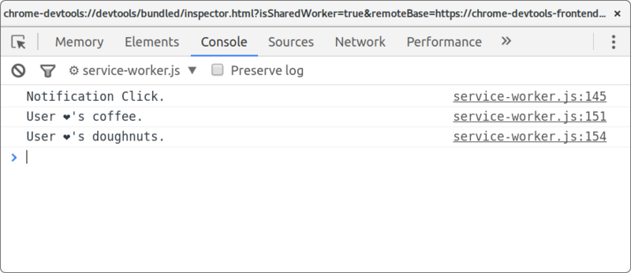
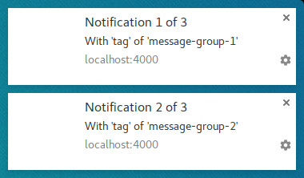

# 行为部分

前文讲述了许多影响外观的配置项，这里将讲述一些影响行为的配置项。

默认情况下，如果只使用上述外观相关的配置项，通知的默认行为如下：

1. 对通知内容进行点击，通知没有变化
2. 新的通知会在老的通知之上显示，浏览器不会对它们进行归类或者折叠等操作
3. 根据设备的不同，可能会在通知弹出时播放声音和震动
4. 在某些设备上，通知经过一段时间会自动消失；在另外一些设备上则不会消失，直到用户点击关闭为止

在这一部分，我们将讨论如何通过配置项来修改上述的默认行为。

## 点击通知

刚才提过，默认情况下用户点击通知不会有任何变化，例如关闭通知。而事实上通知被点击则关闭比较符合我们常见的交互习惯，为了达成这个效果，我们需要在 `service-worker.js` 中进行事件注册，代码如下：

```
self.addEventListener('notificationclick', function (event) {
    const clickedNotification = event.notification;
    clickedNotification.close();

    // 执行某些异步操作，等待它完成
    const promiseChain = doSomething();
    event.waitUntil(promiseChain);
});
```

从示例代码中我们可以看到，通过 `event.notification` 我们可以获取到被点击的通知对象，从而获取它的属性或者调用它的方法。例子中调用了 `close()` 方法就可以关闭通知。

需要注意，如果我们进行了某些异步操作，那么最后的 `event.waitUntil()` 是必不可少的，否则会导致 `service worker` 运行不正常。

## 点击按钮

上一部分提到过通知的按钮配置。这一部分将介绍如何处理这些按钮的点击事件。

假设我们采用和上一部分的相同的按钮配置，配置如下：

```
registration.showNotification('Actions Notification', {
    actions: [
        {
            action: 'coffee-action',
            title: 'Coffee',
            icon: 'https://gss0.bdstatic.com/9rkZbzqaKgQUohGko9WTAnF6hhy/assets/example/action-1-128x128.png'
        },
        {
            action: 'doughnut-action',
            title: 'Doughnut',
            icon: 'https://gss0.bdstatic.com/9rkZbzqaKgQUohGko9WTAnF6hhy/assets/example/action-2-128x128.png'
        },
        {
            action: 'gramophone-action',
            title: 'gramophone',
            icon: 'https://gss0.bdstatic.com/9rkZbzqaKgQUohGko9WTAnF6hhy/assets/example/action-3-128x128.png'
        },
        {
            action: 'atom-action',
            title: 'Atom',
            icon: 'https://gss0.bdstatic.com/9rkZbzqaKgQUohGko9WTAnF6hhy/assets/example/action-4-128x128.png'
        }
    ]
});
```

在用户点击某个按钮时，我们可以监听 `notificationclick` 事件，通过 `event.action` 属性获得按钮的ID（对应 `action` 属性）。例如我们点击咖啡图标，则 `event.action` 的值为 `'coffee-action'`。我们可以参考如下代码：

```
self.addEventListener('notificationclick', function(event) {
    if (!event.action) {
        // 没有点击在按钮上
        console.log('Notification Click.');
        return;
    }

    switch (event.action) {
        case 'coffee-action':
            console.log('User \'s coffee.');
            break;
        case 'doughnut-action':
            console.log('User \'s doughnuts.');
            break;
        case 'gramophone-action':
            console.log('User \'s music.');
            break;
        case 'atom-action':
            console.log('User \'s science.');
            break;
        default:
            console.log(`Unknown action clicked: '${event.action}'`);
            break;
    }
});
```

效果如下：



## 标签(tag)

默认情况下，我们每调用一次 `showNotification` 方法，就发送一条通知，每条之间都是独立的，互相展开的。因此可以想见，如果连续发送多条通知，用户的手机上会充满来自同一个网站的通知，用户很容易产生负面情绪。为了解决这个问题，我们可以尝试使用 `tag` 来解决这个问题。

`tag` 的取值类型是字符串类型，是一个唯一的ID。两个相同ID的通知会被归类到一起。我们来看一下例子：

```
registration.showNotification('Notification 1 of 3', {
    body: 'With \'tag\' of \'message-group-1\'',
    tag: 'message-group-1'
});
```

这样会发送第一条通知：


然后我们再发送一条通知，采用不同的 `tag` ，如下：

```
registration.showNotification('Notification 2 of 3', {
    body: 'With \'tag\' of \'message-group-2\'',
    tag: 'message-group-2'
});
```

于是我们又收到一条通知，加上上一条就会有两条了。



在发送第三条通知时，我们采用和第一条相同的 `tag` ，如下：

```
registration.showNotification('Notification 3 of 3', {
    body: 'With \'tag\' of \'message-group-1\'',
    tag: 'message-group-1'
});
```

如同预期，因为和第一条的 `tag` 相同，所以并没有再弹出第三条通知，而是将第一条通知__替换__为了第三条通知。总体来看，我们调用了三次 `showNotification` 方法，但是用户只显示两条，防止用户体验极度恶化。


如果两条通知包含相同的 `tag` ，除了替换之外，后面一条通知将不会有声音或者震动提示。如果我们的确需要再次有声音或者震动提示，那么我们需要使用 `renotify` 配置。

## 重新通知(renotify)

`renotify` 配置项是和 `tag` 一同使用的。在使用 `tag` 的同时，设置 `renotify` 为 `true` 可以让浏览器在替换通知时提示声音或者震动。最容易想到的使用场景在聊天应用中，有新消息时的提示。示例代码如下：

```
registration.showNotification('Notification 3 of 3', {
    tag: 'message-group-1',
    renotify: true
});
```

注意：如果你使用了 `renotify` 属性但是没有使用 `tag` 属性，代码会有如下报错：

```
TypeError: Failed to execute 'showNotification' on 'ServiceWorkerRegistration':
Notifications which set the renotify flag must specify a non-empty tag
```

## 静默通知(silent)

如字面意思，`silent` 配置项可以让一条通知静默提示，不播放声音或者震动，适合使用在不需要用户立刻响应的通知的情景下，示例如下：

```
registration.showNotification('Silent Notification', {
    silent: true
});
```

注意：如果你同时使用了 `silent` 和 `renotify` 属性，`silent` 会有较高的优先级，即依然为静默通知。

## 用户交互(requireInteraction)

默认情况下，PC下的Google Chrome在展现通知一部分时间后隐藏通知；而Android系统上的Google Chrome会一直显示通知，直到用户交互，例如点击关闭按钮。

为了显式的让通知一直显示直到用户交互，我们可以设置 `requireInteraction` 属性。

```
registration.showNotification('Require Interaction Notification', {
    body: 'With "requireInteraction: \'true\'".',
    requireInteraction: true
});
```

在使用这个配置项时要格外注意，这可能导致用户体验的下降，因为他必须要求用户操作才能移除通知。
