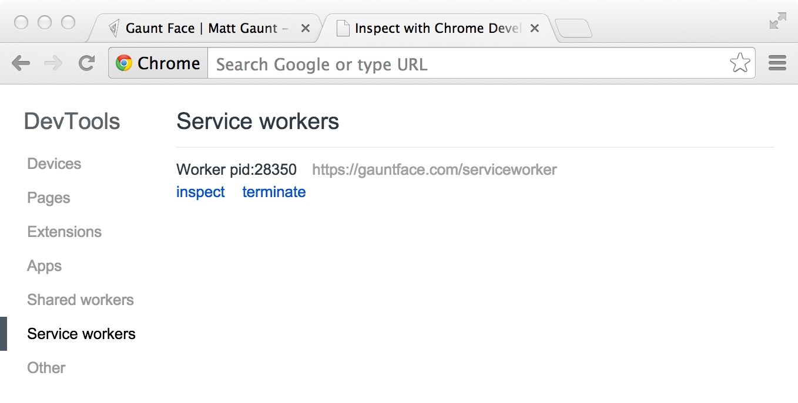

# 怎么使用 Service Worker

我们在 [Service Worker 简介](./service-worker-introduction.md) 中介绍了 Service Worker 的背景和兼容性等内容，然后在 [Service Worker 生命周期](./service-worker-lifecycle.md) 中介绍了 Service Worker 的生命周期以及所有的事件和 API, 但是我们还是不清楚如何才能使用 Service Worker， 以及在什么场景下使用什么 API 等等，这将是这篇文档所要提到的内容。

## 前提条件

Service Worker 出于安全性和其实现原理，在使用的时候有一定的前提条件。

- 由于 Service Worker 要求 HTTPS 的环境，我们通常可以借助于 [github page](https://pages.github.com) 进行学习调试。当然一般浏览器允许调试 Service Worker 的时候 host 为 `localhost` 或者 `127.0.0.1` 也是 ok 的。

- Service Worker 的缓存机制是依赖 [Cache API](https://developer.mozilla.org/zh-CN/docs/Web/API/Cache) 实现的

- 依赖 [HTML5 fetch API](https://developer.mozilla.org/zh-CN/docs/Web/API/Fetch_API)

- 依赖 [Promise](https://developer.mozilla.org/zh-CN/docs/Web/javaScript/Reference/Global_Objects/Promise) 实现

## 注册

要安装 Service Worker， 我们需要通过在 js 主线程（常规的页面里的 js ）注册 Service Worker 来启动安装，这个过程将会通知浏览器我们的 Service Worker 线程的 javaScript 文件在什么地方呆着。

先来感受一段代码：

```js
if ('serviceWorker' in navigator) {
    window.addEventListener('load', function () {
        navigator.serviceWorker.register('/sw.js', {scope: '/'})
            .then(function (registration) {

                // 注册成功
                console.log('ServiceWorker registration successful with scope: ', registration.scope);
            })
            .catch(function (err) {

                // 注册失败:(
                console.log('ServiceWorker registration failed: ', err);
            });
    });
}
```

- 这段代码首先是要判断 Service Worker API 的可用情况，支持的话咱们才继续谈实现，否则免谈了。

- 如果支持的话，在页面 `onload` 的时候注册位于 `/sw.js` 的 Service Worker。

- 每次页面加载成功后，就会调用 `register()` 方法，浏览器将会判断 Service Worker 线程是否已注册并做出相应的处理。

- register 方法的 scope 参数是可选的，用于指定你想让 Service Worker 控制的内容的子目录。本 demo 中服务工作线程文件位于根网域， 这意味着服务工作线程的作用域将是整个来源。

    关于 `register` 方法的 scope 参数，需要说明一下：Service Worker 线程将接收 scope 指定网域目录上所有事项的 fetch 事件，如果我们的 Service Worker 的 javaScript 文件在 `/a/b/sw.js`， 不传 scope 值的情况下, scope 的值就是 `/a/b`。

    scope 的值的意义在于，如果 scope 的值为 `/a/b`， 那么 Service Worker 线程只能捕获到 path 为 `/a/b` 开头的( `/a/b/page1`, `/a/b/page2`，...)页面的 fetch 事件。通过 scope 的意义我们也能看出 Service Worker 不是服务单个页面的，所以在 Service Worker 的 js 逻辑中全局变量需要慎用。

- `then()` 函数链式调用我们的 promise，当  promise resolve 的时候，里面的代码就会执行。

- 最后面我们链了一个 `catch()` 函数，当 promise rejected 才会执行。

代码执行完成之后，我们这就注册了一个 Service Worker，它工作在 worker context，所以没有访问 DOM 的权限。在正常的页面之外运行 Service Worker 的代码来控制它们的加载。

### 查看是否注册成功

如果你很困惑，我的 Service Worker 到底注册成功没有呢？注册成功是什么样子呢？

可以在 PC 上打开我们的好伙伴 chrome 浏览器, 输入 `chrome://inspect/#service-workers`



我们还可以通过 `chrome://serviceworker-internals` 来查看服务工作线程详情。 如果只是想了解服务工作线程的生命周期，这仍很有用，但是日后其很有可能被  `chrome://inspect/#service-workers` 完全取代。

当然，它还可用于测试隐身窗口中的 Service Worker 线程，您可以关闭 Service Worker 线程并重新打开，因为之前的 Service Worker 线程不会影响新窗口。从隐身窗口创建的任何注册和缓存在该窗口关闭后均将被清除。

### 注册失败的原因

为啥会导致 Service Worker 注册失败呢？原因基本就是以下几种情况：

- 不是 HTTPS 环境，不是 `localhost` 或 `127.0.0.1`。

- Service Worker 文件的地址没有写对，需要相对于 origin。

- Service Worker 文件在不同的 origin 下而不是你的 App 的，这是不被允许的。

## 安装

在你的 Service Worker 注册成功之后呢，我们的浏览器中已经有了一个属于你自己 web App 的 worker context 啦， 在此时，浏览器就会马不停蹄的尝试为你的站点里面的页面安装并激活它，并且在这里可以把静态资源的缓存给办了。

install 事件我们会绑定在 Service Worker 文件中，在 Service Worker 安装成功后，install 事件被触发。

install 事件一般是被用来填充你的浏览器的离线缓存能力。为了达成这个目的，我们使用了 Service Worker 新的标志性的存储 cache API — 一个 Service Worker 上的全局对象，它使我们可以存储网络响应发来的资源，并且根据它们的请求来生成key。这个 API 和浏览器的标准的缓存工作原理很相似，但是是只对应你的站点的域的。它会一直持久存在，直到你告诉它不再存储，你拥有全部的控制权。

**localStorage 的用法和 Service Worker cache 的用法很相似，但是由于 localStorage 是同步的用法，所以不允许在 Service Worker 中使用。**
**IndexedDB 也可以在  Service Worker 内做数据存储。**

```js
this.addEventListener('install', function (event) {
    event.waitUntil(
        caches.open('my-test-cache-v1').then(function (cache) {
            return cache.addAll([
                '/',
                '/index.html',
                '/main.css',
                '/main.js',
                '/image.jpg'
            ]);
        })
    );
});
```

- 这里我们 新增了一个 install 事件监听器，接着在事件上接了一个 `ExtendableEvent.waitUntil()` 方法——这会确保 Service Worker 不会在 waitUntil() 里面的代码执行完毕之前安装完成。

- 在 `waitUntil()` 内，我们使用了 caches.open() 方法来创建了一个叫做 v1 的新的缓存，将会是我们的站点资源缓存的第一个版本。它返回了一个创建缓存的 promise，当它 resolved 的时候，我们接着会调用在创建的缓存示例上的一个方法 `addAll()`，这个方法的参数是一个由一组相对于 origin 的 URL 组成的数组，这些 URL 就是你想缓存的资源的列表。

- 如果 promise 被 rejected，安装就会失败，这个 worker 不会做任何事情。这也是可以的，因为你可以修复你的代码，在下次注册发生的时候，又可以进行尝试。

- 当安装成功完成之后，Service Worker 就会激活。在第一次你的 Service Worker 注册／激活时，这并不会有什么不同。但是当 Service Worker 更新的时候 ，就不太一样了。

## 自定义请求响应

走到这一步，其实现在你已经可以将你的站点资源缓存了，你需要告诉 Service Worker 让它用这些缓存内容来做点什么。有了 fetch 事件，这是很容易做到的。

每次任何被 Service Worker 控制的资源被请求到时，都会触发 fetch 事件，这些资源包括了指定的 scope 内的 html 文档，和这些 html 文档内引用的其他任何资源（比如 index.html 发起了一个跨域的请求来嵌入一个图片，这个也会通过 Service Worker），这下 Service Worker 代理服务器的形象开始慢慢露出来了，而这个代理服务器的钩子就是凭借 scope 和 fetch 事件两大利器就能把站点的请求管理的井井有条。

话扯这么多，代码怎么实现呢？你可以给 Service Worker 添加一个 fetch 的事件监听器，接着调用 event 上的 `respondWith()` 方法来劫持我们的 HTTP 响应，然后你可以用自己的魔法来更新他们。

```js
this.addEventListener('fetch', function (event) {
    event.respondWith(
        caches.match(event.request).then(function (response) {
            // 来来来，代理可以搞一些代理的事情

            // 如果 Service Worker 有自己的返回，就直接返回，减少一次 http 请求
            if (response) {
                return response;
            }

            // 如果 service worker 没有返回，那就得直接请求真实远程服务
            var request = event.request.clone(); // 把原始请求拷过来
            return fetch(request).then(function (httpRes) {

                // http请求的返回已被抓到，可以处置了。

                // 请求失败了，直接返回失败的结果就好了。。
                if (!httpRes || httpRes.status !== 200) {
                    return httpRes;
                }

                // 请求成功的话，将请求缓存起来。
                var responseClone = httpRes.clone();
                caches.open('my-test-cache-v1').then(function (cache) {
                    cache.put(event.request, responseClone);
                });

                return httpRes;
            });
        })
    );
});
```

我们可以在 `install` 的时候进行静态资源缓存，也可以通过 `fetch` 事件处理回调来代理页面请求从而实现动态资源缓存。

两种方式可以比较一下：

- on install 的优点是第二次访问即可离线，缺点是需要将需要缓存的 URL 在编译时插入到脚本中，增加代码量和降低可维护性；

- on fetch 的优点是无需更改编译过程，也不会产生额外的流量，缺点是需要多一次访问才能离线可用。

除了静态的页面和文件之外，如果对 Ajax 数据加以适当的缓存可以实现真正的离线可用， 要达到这一步可能需要对既有的 Web App 进行一些重构以分离数据和模板。

## Service Worker 版本更新

`/sw.js` 控制着页面资源和请求的缓存，那么如果缓存策略需要更新呢？也就是如果 `/sw.js` 有更新怎么办？`/sw.js` 自身该如何更新？

如果 `/sw.js` 内容有更新，当访问网站页面时浏览器获取了新的文件，逐字节比对 `/sw.js` 文件发现不同时它会认为有更新启动 [更新算法](https://w3c.github.io/ServiceWorker/#update-algorithm)，于是会安装新的文件并触发 install 事件。但是此时已经处于激活状态的旧的 Service Worker 还在运行，新的 Service Worker 完成安装后会进入 waiting 状态。直到所有已打开的页面都关闭，旧的 Service Worker 自动停止，新的 Service Worker 才会在接下来重新打开的页面里生效。

### 自动更新所有页面

如果希望在有了新版本时，所有的页面都得到及时自动更新怎么办呢？可以在 install 事件中执行 `self.skipWaiting()` 方法跳过 waiting 状态，然后会直接进入 activate 阶段。接着在 `activate` 事件发生时，通过执行 `self.clients.claim()` 方法，更新所有客户端上的 Service Worker。

看一下具体实例：

```js
// 安装阶段跳过等待，直接进入 active
self.addEventListener('install', function (event) {
    event.waitUntil(self.skipWaiting());
});

self.addEventListener('activate', function (event) {
    event.waitUntil(
        Promise.all([

            // 更新客户端
            self.clients.claim(),

            // 清理旧版本
            caches.keys().then(function (cacheList) {
                return Promise.all(
                    cacheList.map(function (cacheName) {
                        if (cacheName !== 'my-test-cache-v1') {
                            return caches.delete(cacheName);
                        }
                    })
                );
            })
        ])
    );
});
```

另外要注意一点，`/sw.js` 文件可能会因为浏览器缓存问题，当文件有了变化时，浏览器里还是旧的文件。这会导致更新得不到响应。如遇到该问题，可尝试这么做：在 Web Server 上添加对该文件的过滤规则，不缓存或设置较短的有效期。

### 手动更新 Service Worker

其实在页面中，也可以手动借助 `Registration.update()` 更新。

参考如下示例：

```js
var version = '1.0.1';

navigator.serviceWorker.register('/sw.js').then(function (reg) {
    if (localStorage.getItem('sw_version') !== version) {
        reg.update().then(function () {
            localStorage.setItem('sw_version', version)
        });
    }
});

```

### debug 时更新

[Service Worker debug 技巧](./service-worker-debug.md) 中也会提到, Service Worker 被载入后立即激活可以保证每次 `/sw.js` 为最新的。

代码如下：

```js
self.addEventListener('install', function () {
    self.skipWaiting();
});

```

### 意外惊喜

 Service Worker 的特殊之处除了由浏览器触发更新之外，还应用了特殊的缓存策略： 如果该文件已 24 小时没有更新，当 Update 触发时会强制更新。这意味着最坏情况下 Service Worker 会每天更新一次。

> info
>
> Set request’s cache mode to “no-cache” if any of the following are true:
>
> - registration’s use cache is false.
> - job’s force bypass cache flag is set.
> - ewestWorker is not null, and registration’s last update check time is not null and the time difference in seconds calculated by the current time minus registration’s last update check time is greater than 86400.
