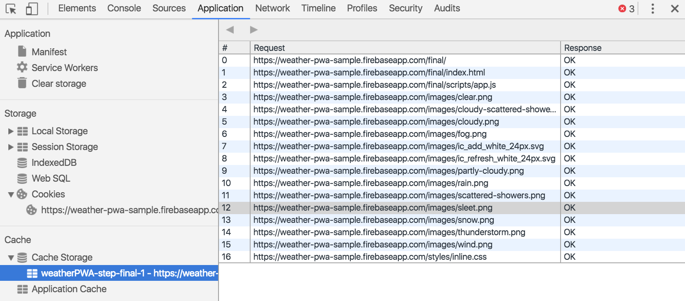

# 如何进行 Service Worker 调试

开发 Service Worker 的过程中，我们如何让我们的开发更加高效并且准确的找出 bug 所在呢？我们在这一章专门讲一讲如何调试 Service Worker。

Service Worker 作为独立于主线程的独立线程，在调试方面有其实和常规的 javaScript 开发类似，我们关注的点大概有如下几点：

- 代码是否有报错

- Service Worker 能否顺利更新

- 在不同机型上的兼容性问题 debug

- 不同类型资源和请求的缓存策略的验证

## debug 环境下的开发跳过等待状态

我们都知道，根据 Service Worker 生命周期的特性，如果浏览器还在使用旧的 Service Worker 版本，如果有 Service Worker 新的版本的话也不会立即被浏览器激活，只能进行安装并进入等待状态，直到浏览器 Tab 标签被重新关闭打开。

在开发调试 Service Worker 时肯定希望重新加载后立即激活，我们不希望每次都重新打开当前页面调试，为此我们可以在 `install` 事件发生时通过 `skipWaiting()` 来设置 skip waiting 标记。 这样每次 Service Worker 安装后就会被立即激活。

```js
self.addEventListener('install', function () {
    if (ENV === 'development') {
        self.skipWaiting();
    }
});
```

但是当浏览器未检测到 Service Worker 发生变化时（比如该文件设置了 HTTP 缓存）， 甚至连安装都不会被触发。现在可以借助于浏览器 DevTools 调试了： 比如在 Chrome DevTools 的 Application 标签页勾选 `Update on reload`，Chrome 会在每次刷新时去访问 Service Worker 文件并重新安装和激活。

## 借助 Chrome 浏览器 debug

使用 Chrome 浏览器，可以通过进入控制台 `Application -> Service Workers` 面板查看和调试。如下图所示：


如果 Service Worker 线程已安装到当前打开的页面上，您会看到它将列示在此窗格中。 例如，在上方的屏幕截图中，`zoumiaojiang.github.io/serviceWorker/sw-test/` 的作用域内安装了一个 Service Worker 线程。

我们熟悉一下这些个选项：

- **offline**： 复选框可以将 DevTools 切换至离线模式。它等同于 Network 窗格中的离线模式。

- **Update on reload**：复选框可以强制 Service Worker 线程在每次页面加载时更新。

- **Bypass for network**：复选框可以绕过 Service Worker 线程并强制浏览器转至网络寻找请求的资源。

- **Update**：按钮可以对指定的 Service Worker 线程执行一次性更新。

- **Push**：按钮可以在没有负载的情况下模拟推送通知。

- **Sync**：按钮可以模拟后台同步事件。

- **Unregister**：按钮可以注销指定的 Service Worker 线程。

- **Source**：告诉你当前正在运行的 Service Worker 线程的安装时间。 链接是 Service Worker 线程源文件的名称。点击链接会将您定向至 Service Worker 线程来源。

- **Status**：告诉你 Service Worker 线程的状态。此行上的数字（上方屏幕截图中的 #1）指示 Service Worker 线程已被更新的次数。如果启用 `update on reload` 复选框，您会注意到每次页面加载时此数字都会增大。在状态旁边，您将看到 `start` 按钮（如果 Service Worker 线程已停止）或 `stop` 按钮（如果 Service Worker 线程正在运行）。 Service Worker 线程设计为可由浏览器随时停止和启动。 使用 stop 按钮明确停止 Service Worker 线程可以模拟这一点。停止 Service Worker 线程是测试 Service Worker 线程再次重新启动时的代码行为方式的绝佳方法。它通常可以揭示由于对持续全局状态的不完善假设而引发的错误。

- **Clients**：告诉你 Service Worker 线程作用域的原点。 如果您已启用 `show all` 复选框，`focus` 按钮将非常实用。 在此复选框启用时，系统会列出所有注册的 Service Worker 线程。 如果您点击正在不同标签中运行的 Service Worker 线程旁的 `focus` 按钮，Chrome 会聚焦到该标签。

如果 Service Worker 文件在运行过程中出现了任何的错误，将显示一个 `Error` 新标签。


当然我们也可以通过 `Chrome://serviceworker-internals` 也可以打开 serviceWorker 的配置面板，查看所有注册的 Service Worker 情况。注意一点，如无必要，不要选中顶部的 `Open DevTools window and pause javaScript execution on Service Worker startup for debugging` 复选框，否则每当刷新页面调试时都会弹出一个开发者窗口来。

在 Firefox 中，可以通过 `Tools -> Web Developer -> Service Workers`，打开调试面板。也可以通过输入 URL 直接进入该面板：`about:debugging#workers`。

## 查看 Service Worker 缓存内容

我们已经了解过，Service Worker 使用 Cache API 缓存只读资源，我们同样可以在 Chrome DevTools 上查看缓存的资源列表。

Cache Storage 选项卡提供了一个已使用（Service Worker 线程）Cache API 缓存的只读资源列表。



这里有个地方需要注意一下：第一次打开缓存并向其添加资源时，Chrome DevTools 可能检测不到更改。 重新加载页面后，您应当可以看到缓存。

如果您打开了两个或多个缓存，您将看到它们列在 Cache Storage 下拉菜单下方。


当然，Cache Storage 提供清除 Cache 列表的功能，在选择 `Cache Storage` 选项卡后在 Cache Storge 缓存的 key 的 item 上右键点击出现 `delete` ，点击 `delete` 就可以清除缓存列表了。


也可以选择 `Clear Storage` 选项卡进行清除缓存。

## 网络跟踪

此外经过 Service Worker 的 `fetch` 请求 Chrome 都会在 Chrome DevTools Network 标签页里标注出来，其中：

- 来自 Service Worker 的内容会在 Size 字段中标注为 `from ServiceWorker`

- Service Worker 发出的请求会在 Name 字段中添加 ⚙ 图标。

例如下图中，第一个名为 `300` 的请求是一张 jpeg 图片， 其 URL 为 `https://unsplash.it/200/300`，该请求是由 Service Worker 代理的， 因此被标注为 `from ServiceWorker`。

为了响应页面请求，Service Worker 也发出了名为 `300` 的请求（这是图中第二个请求）， 但 Service Worker 把 URL 改成了 `https://unsplash.it/g/200/300`，因此返回给页面的图片是灰色的。


## 安卓真机 debug

由于目前 iOS 不支持 Service Worker，我们在这里只讨论安卓机的调试。而 Service Worker 必须要在 HTTPS 环境下才能被注册成功，所以我们在真机调试的过程中还需要解决 HTTPS 调试问题，当然 `127.0.0.1` 和 `localhost` 是被允许的 host，但是我们在真机调试上并不能采用 :(。
