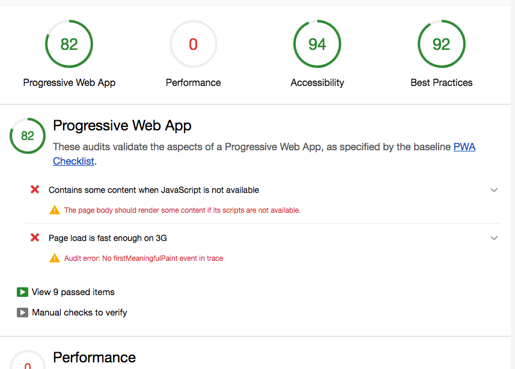

# 使用 Lighthouse 审查 WebApp

Lighthouse 是一个开源的自动化工具，用于评价 WebApp 多方面的效果指标，并给出建议以帮助开发者改进 WebApp 的质量。

你可以通过2种方式来安装并使用 Lighthouse

1. Chrome 插件形式： Lighthouse - Chrome 网上应用商店
2. 命令行形式： `npm install -g lighthouse`

为 Lighthouse 提供一个你要审查的网址，它将针对此页面运行一连串的测试，然后生成一个有关页面性能的报告。通过报告你可以看看可以采取哪些措施来改进您的应用。

> 注：Lighthouse 目前非常关注 Progressive Web App 功能，如`添加到主屏幕`和`离线支持`。不过，此项目的首要目标是针对网络应用质量的各个方面提供端到端审查。

## 使用入门

前面说过使用 Lighthouse 的两种方式，各有适用场景。Chrome 插件的形式提供了更加友好的用户界面，方便读取报告。而命令行工具则方便将 Lighthouse 集成到持续集成系统。

### Chrome 插件

下载 Google Chrome 52 或更高版本。

安装 [Lighhouse Chrome 插件](https://security.stackexchange.com/questions/20803/how-does-ssl-tls-work)

打开需要进行审查的页面，并点击 Chrome 工具栏上的 Lighthouse 图标 

如果在工具栏上没有看到此图标，它可能隐藏在 Chrome 的主菜单中。

点击此图标后，你会看到一个展开菜单，如下图


在 `Options` 选项里，可以选择需要的审查项。


点击 Generate report 按钮以针对当前打开的页面运行 Lighthouse 测试。

在完成审查后，Lighthouse 将打开一个新标签，并在页面的结果上显示一个报告。



在这里，你就能看到关于 PWA, Performance, Accessibility, Best Practices 四个方面存在的问题以及相关建议。根据这些去优化你的站点吧！

### 命令行工具

安装 [Node](https://nodejs.org/zh-cn/download/)，需要 5 及以上版本。

以全局方式安装：

```shell
npm install -g lighthouse
```

针对一个页面运行 `lighthouse` 命令，进行审查：

```shell
lighthouse https://www.example.com/
```

输入 `--help` 选项可以查看可用的输入、输出选项

```shell
lighthouse --help
```