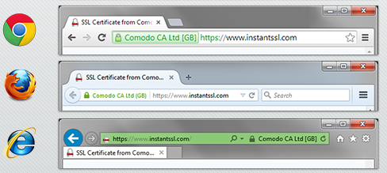

# Web安全

构建 PWA 应用时，安全是一个十分重要的话题。基于 Web 环境的互联网应用越来越广泛，其安全问题也日益凸显，代码中的细小漏洞随时可能被攻击者利用，导致用户的隐私信息泄露、财产损失。本章节从以下几个角度入手，帮助您构建更加安全的 Web 应用。

[使用 HTTPS](#使用-HTTPS)

[同源策略](https://github.com/searchfe/pwa-doc/blob/master/web-security/02-same-origin-policy.md)

[内容安全策略](https://github.com/searchfe/pwa-doc/blob/master/web-security/03-content-security-policy.md)

[典型的安全漏洞](https://github.com/searchfe/pwa-doc/blob/master/web-security/04-typical-web-attack.md)

## 使用 HTTPS

HTTPS 即 HTTP over SSL/TLS，是 HTTP 的安全版本，在 HTTP 上加了一层处理加密信息的模块。
 SSL/TLS 全称安全传输层协议 Transport Layer Security, 是介于 TCP 和 HTTP 之间的一层安全协议，不影响原有的 TCP 协议和 HTTP 协议，所以使用 HTTPS 基本上不需要对 HTTP 页面进行太多的改造。浏览器访问支持 HTTPS 的站点时，在地址栏的前面会有一把绿色的锁一样的标识，表明 HTTPS 生效了。



HTTPS 的主要作用是：

1. 对数据进行加密，并建立一个信息安全通道，来保证传输过程中的数据安全;
2. 对网站服务器进行真实身份认证。

SSL/TLS 协议采用非对称加密方式，服务端会生成公钥和私钥，公钥用来加密信息，可以提供给所有需要进行通信的客户端，私钥保存在本地，不能泄露。客户端使用这份公钥对信息进行加密，将请求发送给服务器，服务器用私钥解密。反之，服务器对客户端的返回，则使用客户端提供的公钥进行加密，客户端使用本地对应的私钥来解密，保证了通信的安全。

详细可以参考：[这里](https://security.stackexchange.com/questions/20803/how-does-ssl-tls-work)

基于 SSL/TLS 进行 一次的 HTTPS 会话的过程，简单地说可以分成3步

1. 客户端向服务器端索要并验证公钥。
2. 双方协商生成"对话密钥"。
3. 双方采用"对话密钥"进行加密通信。


HTTPS 服务器拥有一张数字证书，包含了经过认证的网站公钥和一些元数据，客户端和服务端通信时，会首先验证证书的有效性，来决定是否继续通信。这样一来，经过了身份认证、信息加密等步骤，网络通信安全就得到了保障。

### 使用 HTTPS 的理由

HTTP 协议采用明文传输信息，存在信息窃听、信息篡改和信息劫持的风险，使用 HTTPS 则有以下几个方面的优势：

#### 保护站点安全

HTTPS 的通信信息都是加密传播，第三方无法窃听，且具有校验机制，一旦信息被篡改，通信双方就能立刻发现，这样就能够有效防止入侵者篡改网络通信内容。这些入侵者包括但不局限于恶意攻击者，合法但极具威胁的竞争对手，通信运营商等等。特别是在国内，运营商劫持插入广告信息的现象早已屡见不鲜，这些都能通过升级 HTTPS 来规避。

#### 保护用户隐私

如果单纯地认为，只有涉及到敏感数据的网站才需要升级 HTTPS，那就大错特错了。事实上每一个不受保护的 HTTP 请求都有暴露用户行为、用户身份的风险。虽然这些单个请求看起来没有什么敏感信息，也不能造成什么损失，但攻击者可以长期监视用户的浏览活动，通过收集大量数据推断用户的行为、地理位置、生活习惯等，从而造成用户的隐私信息泄露。

#### 未来的趋势所在

将 Web 应用升级成为 HTTPS 是大势所趋，HTTPS 一方面能够保障站点的安全、保护用户的隐私，随着 Web 应用平台的多元化发展，拍照、视频等功能都需要较高的用户权限许可，而使用 service worker 启用离线应用功能、构建 PWA 应用等已经将 HTTPS 视为必要条件。Google 早就倡议所有的 Web 站点都应该使用 HTTPS， 而且将 HTTPS 站点的搜索结果排名权重进行提升，想必在未来，这也是促进站长将站点进行 HTTPS 化的一个重要理由。


### 升级 HTTPS

将 Web 应用升级成 HTTPS 一般需要以下几个步骤。

1.获取证书

HTTPS 是由证书认证机构 CA（Certificate Authority）颁发的、并包含公开密钥拥有者信息、公开密钥、签发者信息、有效期以及一些扩展信息、能提供在互联网上进行身份验证的一种权威性数字文件。要保证数字证书的真实性，必须确保该数字证书是由具有权威性的国际 CA 中心签发的，如 Symantec 就是这样一家通过 Web Trust 认证的国际 CA。购买 CA 颁发的证书有很多类型，分为域名认证、公司认证、扩展认证三个级别，还分成单域名、通配符、多域名三种覆盖范围。认证级别越高、覆盖范围越广的证书，价格越贵。

2.在服务器安装证书

可以将证书文件存放在 `ect/ssl` 目录，然后选择对应的服务器进行配置，使用 [Mozilla 便捷的配置生成器](https://www.w3.org/TR/CSP/)

3.重定向配置

将 HTTP 的访问请求 301 到 HTTPS

Nginx
```
server {
	listen 80;
	server_name domain.com www.domain.com;
	return 301 https://domain.com$request_uri;
}
```
Apache （.htaccess文件）
```
RewriteEngine On
RewriteCond %{HTTPS} off
RewriteRule (.*) https://%{HTTP_HOST}%{REQUEST_URI} [R=301,L]
```
4.修改资源链接

将站点所有的 HTTP 资源地址替换成 HTTPS，一个比较好的方法是直接将协议头替换成 `//`，这样浏览器会自动根据当前页面的协议加载相同协议头的资源，更为灵活。例如：
```
<script src="http://a.com/jquery.js"></script>
```
改为
```
<script src="//a.com/jquery.js"></script>
```

如果修改不完全，HTTPS 资源和 HTTP 资源混合出现，即页面包含 [`混合内容`](#防止混合内容)，浏览器将警告用户已失去 HTTPS 的全部能力（直观的看，地址栏 HTTPS 的标识将处于失效状态）。事实上，如果是主动混合内容（脚本、插件、CSS、iframe），则浏览器通常根本不会加载或执行此内容，从而导致页面残缺。

5.可以进一步保证安全：设置 Cookie 安全标记

如果用户的身份验证 Cookie 将在明文中暴露，则整个会话的安全保障将被破坏，因此，应该确保浏览器只在使用 HTTPS 时，才发送 Cookie。

在网站响应头里面，Set-Cookie字段加上Secure标志即可。
```
Set-Cookie: LSID=DQAAAK...Eaem_vYg; Secure
```

迁移成为 HTTPS 后，也不必过分担心额外的性能开销问题。HTTPS 和 HTTP 相比，在 TCP 三次握手的基础上，还多了 SSL 握手的过程，也叫SSL延迟。当总体内容和应用层性能优化得当时，这些都是小问题了。

### 防止混合内容

混合内容（Mixed Content）在以下情况出现：初始 HTML 内容通过安全的 HTTPS 连接加载，但其他资源（例如，图像、视频、样式表、脚本）则通过不安全的 HTTP 连接加载。混合内容，顾名思义，即在同一个页面同时混合加载了 HTTP 和 HTTPS 内容，且通过 HTTPS 加载的初始请求是安全的。现代浏览器会针对此类型的内容显示警告，告诉用户此页面包含不安全的资源。

混合内容的存在会降低整个页面的安全性，因为这些请求容易受到 XSS，中间人等各种攻击。用户看到这些 Warning 的时候，如果存在威胁，很有可能已经被攻击。所以开发者有义务将资源替换成 HTTPS，减少安全风险。

一般会把混合内容分成两种

被动混合内容，指的是不与页面其余部分进行交互的内容，中间人攻击在拦截或更改能执行的操作有限。被动混合内容包括图像、视频和音频内容，以及无法与页面其余部分进行交互的其他资源。

主动混合内容，它作为整体与页面进行交互，并且几乎允许攻击者对页面进行任何操作。主动混合内容包括浏览器可下载和执行的脚本、样式表、iframe、flash 资源及其他代码。

鉴于上述威胁，浏览器最好是阻止所有混合内容。但这极易导致大量站点不可用。当前的折衷做法是阻止最危险的混合内容类型，同时仍允许请求不太危险的混合内容类型。现代浏览器遵循[混合内容规范](https://w3c.github.io/webappsec-mixed-content/)，其定义了可选择性地阻止的内容和可阻止的内容类别。

根据此规范，当前可选择性阻止的内容中仅包括图像、视频和音频资源以及预获取这些资源的链接等。随着时间的推移，此类别可能会缩小。可选择性阻止的内容以外的所有内容被视为可阻止的内容，将被浏览器阻止。

混合图片内容，Chrome 给出警告：


对于混合脚本，Chrome 会阻止加载：


值得注意的是，不同浏览器供应商的不同版本的浏览器处理混合内容的方式不尽相同。所以对于开发者来说，修复 HTTPS 站点中的混合内容十分重要。

### 批量处理 HTTPS 站点中的混合内容

1.使用 [CSP](https://github.com/searchfe/pwa-doc/blob/master/web-security/03-content-security-policy.md) 查找混合内容

给网站设置响应头：
```
Content-Security-Policy-Report-Only: default-src https: 'unsafe-inline' 'unsafe-eval'; report-uri https://example.com/reportingEndpoint

```
这样用户访问站点时，浏览器都会向 https://example.com/reportingEndpoint 发送请求，告诉你哪些内容存在不规范。

2.自动升级不安全的请求

可以使用 CSP 的 [upgrade-insecure-requests](https://www.w3.org/TR/upgrade-insecure-requests/) 配置项，浏览器在请求 http 资源时，会自动升级请求对应的 https 资源。

如，配置请求头
```
Content-Security-Policy: upgrade-insecure-requests
```
或，使用`meta`标签
```
<meta http-equiv="Content-Security-Policy" content="upgrade-insecure-requests">
```
都能使浏览器对 `` 的请求转向 `https://example.com/image.jpg`。但注意，这时需要保证升级后的资源地址可用，不然就会请求失败。

3.阻止所有混合内容

配置请求头
```
Content-Security-Policy: block-all-mixed-content
```
或，使用`meta`标签
```
<meta http-equiv="Content-Security-Policy" content="block-all-mixed-content">
```
将导致所有不安全的混合内容被浏览器阻止，但这个存在"误杀"的风险，慎重使用。
